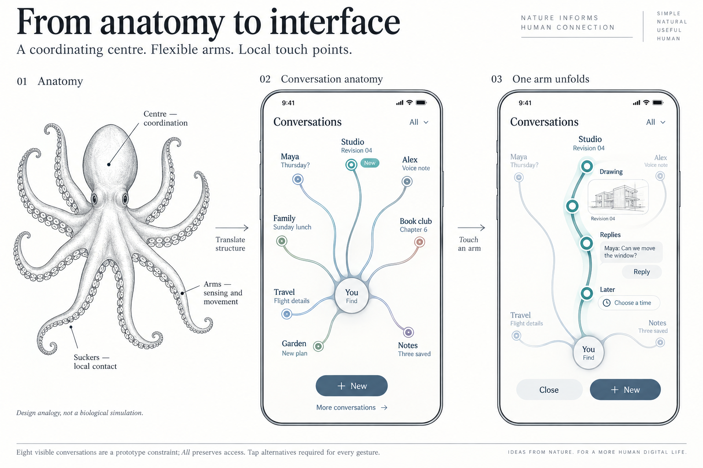
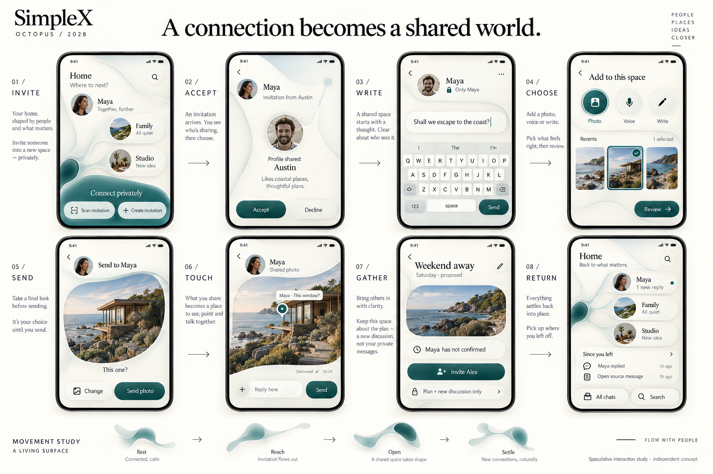

# From anatomy to interface

**The future of mobile design for [simplex.chat](https://simplex.chat/).**



## Start here: from anatomy to interface

A coordinating centre. Flexible arms. Local touch points. This is the opening model for the story: how anatomy suggested a different way to organise interaction. Then follow the earlier sketches, each visual iteration and the working studies.

**An independent community design exploration of the future mobile experience of [simplex.chat](https://simplex.chat/) in 2028.**

I started with a question: could the mobile chat interface become a continuous workspace that opens around what we are doing, then quietly settles when we leave?

My starting principle was **“design has no ego.”** The person, the relationship and the conversation should have the greatest presence.

The octopus followed a different evolutionary journey from us. That gives this project its central question: could simplex.chat evolve an interface from its own foundations, rather than inherit every convention from WhatsApp and Telegram? Flexible form, local action and selective visibility are starting points for that exploration. This repository takes you through that thinking, shows the concepts and working interactions, and invites passionate designers, researchers and builders to challenge and extend them.

**[Read the illustrated journey](https://austinwerner-kai.github.io/future-mobile-design-simplex-chat/)** · **[Try the interaction](https://austinwerner-kai.github.io/future-mobile-design-simplex-chat/prototypes/continuous-demo.html)** · **[Join the welcome discussion](https://github.com/AustinWerner-KAI/future-mobile-design-simplex-chat/discussions/1)**

The project presentation and working study are hosted on GitHub Pages. You can also open `index.html` locally. No application install is required.

**[All concepts: nine boards and five working studies](https://austinwerner-kai.github.io/future-mobile-design-simplex-chat/concepts.html)**

The anatomy board opens the explanation. [The iteration record](docs/ITERATIONS.md) preserves actual creation order, including the earlier designs that did not yet resolve the idea.

## The 2028 reset — questioning V2

V2 improved familiar screens but did not yet demonstrate a different experience. [Read the audit and refined goals](docs/2028_DESIGN_RESET.md), then [explore one continuous journey in three stronger colour treatments](https://austinwerner-kai.github.io/future-mobile-design-simplex-chat/future.html). The study follows a source question into a private proposal, an explicit sharing boundary and a quiet return. It is a hypothesis for community testing, not a finished answer.

## Five V2 baseline studies

**[Explore all five V2 designs](https://austinwerner-kai.github.io/future-mobile-design-simplex-chat/v2.html)**: chat list, QR invitations, profile privacy, conversation verification and group membership. These use a website-aligned blue palette and are informed by [SimpleX research](docs/SIMPLEX_RESEARCH.md). [The future-fit notes](docs/APP_INTEGRATION.md) explore how an evolved experience could belong in SimpleX. The objective is discovering the future, not reinventing today’s app. All flows remain independent browser simulations.

## Follow the thinking

- [Every iteration and its thinking](docs/ITERATIONS.md): question, response, critique and next direction.
- [The full narrative](docs/THINKING.md): questions, principles, predictions, nature-inspired mappings, concept evolution and invitation.
- [The design brief](docs/DESIGN_BRIEF.md): the job, boundaries and first milestone.
- [Core screen layouts and wireframes](studies/core-wireframes.html): the structural flow behind the visual boards.
- [The design language](docs/DESIGN_LANGUAGE.md): form, movement, typography and interaction rules.
- [The full project audit](docs/FULL_AUDIT.md): findings, fixes, verification and remaining design questions.
- [The honest critique](docs/CRITIQUE.md): what remains unresolved.
- [The five challenges](docs/CHALLENGES.md): concrete starting points for contributors.

## The five design hypotheses

1. A living present with proposals and source messages.
2. Tools that unfold beside the relevant object.
3. Photographs as places for anchored replies.
4. Readable audiences and deliberate invitations.
5. Quiet return points that preserve context.

Chat and email can share organisation around a relationship while their channel and privacy properties remain explicit. Email integration is a scenario from the originating conversation, not a verified SimpleX product commitment.

## Build with us

You can contribute a sketch, motion study, usability observation, accessibility finding or small prototype. Start with one problem and show what improves for the person using it.

Read [CONTRIBUTING.md](CONTRIBUTING.md), use a [design proposal or finding](https://github.com/AustinWerner-KAI/future-mobile-design-simplex-chat/issues/new/choose), or join an open challenge. Discussions are for exploration; issues scope work; pull requests change the reference experience.

Maintainers curate a coherent direction and record decisions with their evidence. Popularity alone does not establish usability or privacy.

## Try and edit the prototype

The [concept library](https://austinwerner-kai.github.io/future-mobile-design-simplex-chat/concepts.html) links all working studies:

- [One list, many conversations](prototypes/menu-list.html): seven conversations, multiple message previews, search, filters and local replies.
- [Your people — opening and closing](prototypes/maya-opening.html), matching the original screenshot.
- [Your people — photo workspace](prototypes/maya-photo.html).
- [Shared messaging — early plan study](prototypes/shared-plan.html), with historical simulated-acceptance shortcuts.
- [Combined experience](prototypes/continuous-demo.html).

Open `prototypes/continuous-demo.html` directly in a modern browser. It covers private messaging, preserved drafts, photo preview and point replies, a proposed plan, invitations, separate joining and date confirmation, new connections and an email reply scenario.

All participants and incoming messages are fictional. Sending and acceptance are simulated locally. No real SimpleX connection, email delivery or cryptographic access control is implemented. Photos are selected locally and remain memory-only. This is a design study.

Edit `prototypes/src/octopus-continuous.html`, then rebuild the standalone preview with Node:

```sh
node scripts/build-demo.mjs
```

No packages or framework are needed. To browse the whole project locally:

```sh
python3 -m http.server 8000
```

## What still needs work

The home now explores coordinated paths around a centre; navigation with many contacts remains unproven. Several flows use a generic expansion origin. Large contact sets, screen readers, full reload restoration and protocol feasibility need further work. The boards and prototype differ in detail. See the critique before treating either as a specification.



## Independence, provenance and rights

Initiated by [AustinWerner-KAI](https://github.com/AustinWerner-KAI), shaped from a design conversation with AI assistance. The concept boards are AI-generated; two preserved generation prompts and editable prototype source are included. The earlier seven boards’ exact prompts were not preserved.

[simplex.chat](https://simplex.chat/) is our first design case. This project is unaffiliated with SimpleX or Jony Ive and does not represent their roadmap or endorsement.

See [LICENSING.md](LICENSING.md) for current reuse terms. Contributors retain attribution. See [CODE_OF_CONDUCT.md](CODE_OF_CONDUCT.md) for community expectations.
