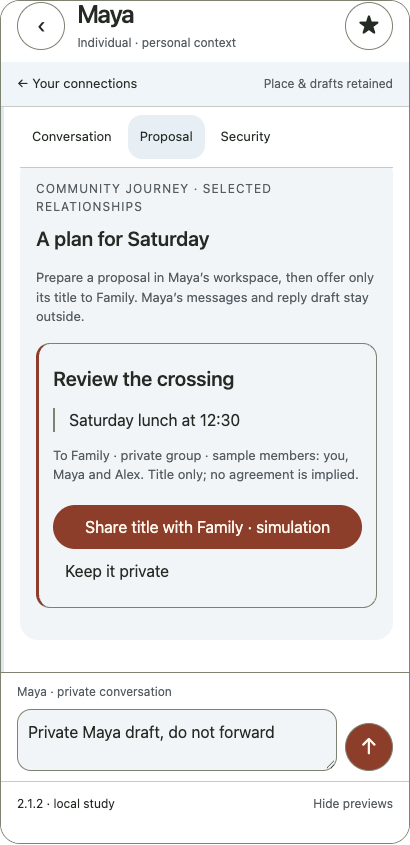
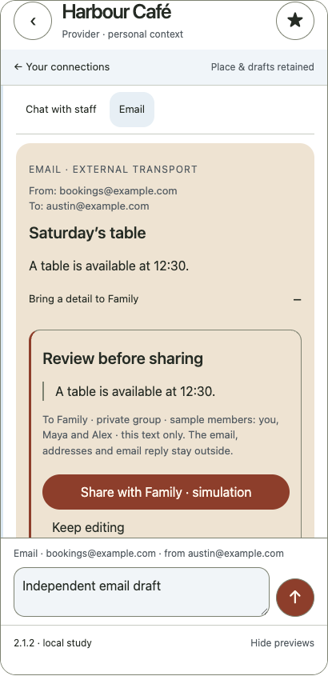

# Small-community journey — T04

4 October 2026. [Open the interactive test](../studies/community-journey.html) · [Project todo checklist](NEXT_STEPS.md). V2 remains the current project reference; this is a candidate scenario using V2.1.2.

## Product intention

Follow one human purpose across a person, group and provider. The home starts with relationships. Local tools support the purpose without silently moving private conversation history between entities. This responds to the founder’s relationship-first direction as supplied by the project owner; it is independent design work and no private correspondence is reproduced.

## Flow and boundaries

1. **Maya:** write an unsent reply, then prepare a proposal title. The reply and proposal are independent drafts.
2. **Family:** from Maya’s workspace, review the exact title and Family’s fictional audience (you, Maya and Alex). Cancel or explicitly share the snapshot. No private source messages or reply draft are forwarded. Sharing does not imply agreement.
3. **Harbour Café:** open the provider selected for the fictional plan. Opening does not share group history, members or the proposal with staff. Staff chat and email remain separate.
4. **Email excerpt:** prepare a detail privately; review the text and Family audience before simulated sharing. Original email, addresses and reply draft stay outside the handoff. Email does not inherit SimpleX chat security.
5. **Return:** inspect the excerpt in Family, recover the independent group draft, then return to Maya’s retained reply. Home returns to the coordinating index.

The plan does not imply the café is booked. Group members have not agreed, provider affiliation is not inferred, and no connection or real delivery happens. Fixed fictional audiences are sufficient for this scenario, not a general permissions system.

## Octopus architecture

Coordination comes from one home. Actions unfold locally in the selected relationship. Space adapts to the active task. Separate drafts and reading positions retain context. Reviews make crossings deliberate. Return restores the previous work. This is the architectural analogy; a literal animal shape is unnecessary.

## Test and progress record

The HTML test page contains six reviewer steps with manual ticks and reset. Those ticks are RAM-only session notes; they clear on reload and do not update the project tracker. [NEXT_STEPS.md](NEXT_STEPS.md) is the durable Git-based checklist with stable task IDs and evidence requirements. T04 marks a completed prototype demonstration. T05 remains open until actual phone and participant testing is done.

[Browser evidence](community-journey-check.json) checks review/cancellation, excluded private material, duplicate prevention, independent drafts, return, page fit and session checklist controls. It cannot establish human understanding or protocol security.

## Editable implementation

- `prototypes/src/v21/app.js`: optional `journey=community` scenario; baseline sharing remains to Maya, the scenario explicitly selects Family.
- `studies/community-journey.html`: task instructions, manual checklist and independent embedded prototype.
- `scripts/check-community-journey.cjs`: boundary and state regression checks.

Reload or resetting the iframe clears simulated state. General recipient selection, group role changes, profile switching, real images and recovery beyond page memory remain separate open tasks. Original code MIT; original design CC BY 4.0. [Source register](SOURCES.md).

## Captured review states

Browser captures of fictional local simulation, not real delivery:

