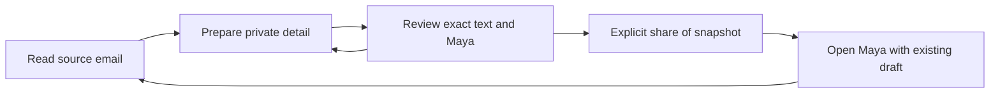

# Email evolves through deliberate handoffs

> **Latest edit — [V2.1.2.1: complete interface mockup](https://austinwerner-kai.github.io/future-mobile-design-simplex-chat/v2121.html). Start here.** [Try the interactive version](https://austinwerner-kai.github.io/future-mobile-design-simplex-chat/v21.html?mobile=1&version=2.1.2.1). Published 4 October 2026: 14 interface states and the community-test refinements. V2 is the earlier reference baseline; older audits and screenshots retain their original version scope. This is a browser design study, not a production release.

> Current reference, 4 October 2026: [shared design brief](DESIGN_BRIEF.md) · [evolution rationale](EVOLUTION_FROM_ANATOMY.md) · [visual progression](../studies/concept-progression.html). Dated audits and earlier palette proposals below remain iteration evidence.

4 October 2026. Applies kings-of-mobile-design to the future SimpleX email concept. [Try the experiment](../unfold.html?mobile=1#Harbour%20bookings) · [Visual storyboard](../studies/email-storyboard.html) · [Design memory](DESIGN_MEMORY.md)

## Mobile brief

Product: speculative communication experience for SimpleX, combining private messages, public channels and external email. Audience: a person coordinating a booking with a friend while moving between short, interrupted tasks; this persona is assumed, not researched. Primary job: use a useful email detail in a conversation without forwarding unrelated personal material or losing the original reply.

Platform: dependency-free mobile web prototype, with native SwiftUI/Compose adaptation still open. Test windows: compact portrait, short windows and landscape. Data is sensitive in the intended product; fixtures here are fictional. Five semantic material palettes, scalable layout, labelled controls, native browser history and reduced-motion support remain shared constraints.

No mailbox, permissions, network or cryptography are connected. Page-session memory is simulated retention, not persistence across process loss. Real mail-provider scopes, authentication and delivery semantics remain unresolved implementation decisions. This experiment adds an interaction, state model, editable source and browser verification; it is not a production integration.

## Thesis: carry a detail, keep the source

A unified inbox alone does not show a different evolutionary trajectory. The more useful experiment is letting a person reach between contexts without erasing the boundary between them.

Inside the booking email, choose **Carry a detail**. A quoted sentence becomes an editable private working object. Review exactly what Maya would receive, then explicitly share that snapshot. The email, sender/recipient addresses, attachments and email reply remain outside the share. Opening Maya reveals the selected detail without replacing the existing private reply draft.

This is the octopus analogy in behaviour: the list coordinates, the active email gives a local tool room to unfold, and a deliberate handoff reaches another relationship. It is not anatomical replication or proof that biology predicts messaging. No AI interpretation, automatic forwarding or recipient inference is involved.

The tradeoff is a review step and more local state to understand. The experiment earns its place only if people can explain the boundary more accurately and recover their work with less reconstruction than conventional forwarding/copying.

## Navigation and responsibilities

The shared menu retains Private, Channels and Email type filters. Opening an email brings its expanded entry into view. Reply by email and Carry a detail are local tools, not separate top-level destinations. Tool changes preserve the original email reply draft. Folding, opening Maya and browser Back operate through relationship history. Colour changes preserve the working state.

The email exposes its external transport, exact From/To and source body. The handoff exposes a private working object, then the destination relationship/profile and an exact text snapshot. No channel destination is silently offered as a substitute for a private recipient. This fixture supports one recipient, Maya; a real picker must require deliberate recipient/profile selection. The V2.1 runtime now explores that picker; see [T11](T11_EMAIL_HANDOFF.md).

## Handoff state model

Editing a private working detail cannot alter a previously shared snapshot. Preparing the same already-shared detail disables the review action. The final handler also guards against duplicate commits. A revised detail may produce a new snapshot. Blank text cannot be reviewed. Cancelling the review keeps the edit and shares nothing.

The prototype records simulated sharing, not recipient agreement, delivery or cryptographic authorization. The text copied into Maya is visible in the ordinary conversation history, labelled as an email detail shared by the person. Its origin in email does not upgrade email’s security properties.

## Email reply and uncertain delivery

Email has its own composer, recipient and draft. The Delivery scenario disclosure is labelled **study**; it configures the next simulated send and is not a production account setting.

| State | What is true in the model | Available recovery |
|---|---|---|
| Draft | No send committed | Edit, fold or change tool without losing text in this session |
| Queued locally | Offline scenario; not sent | Explicit send attempt; cancel before sending |
| Outcome unknown | Connection-loss scenario after submission | Inspect/check outcome; do not submit the same reply again |
| Server accepted | Acceptance is simulated; delivery remains unconfirmed | Inspect the record; no claim that the recipient received it |
| Cancelled | A local queued reply was cancelled before submission | Text remains in the record; restore it to the composer if no newer draft would be overwritten |

An identical reply already queued, unknown or accepted cannot be submitted again. This prevents a local duplicate in the same email fixture. It is not backend idempotency or an RFC-level email delivery guarantee. Checking an uncertain outcome has a predetermined simulated acceptance result; a real implementation must query/reconcile provider evidence and retain uncertainty when evidence is unavailable.

## Craft and mobile behaviour

The external email uses a pale oat service tone, envelope mark and dashed origin line. A shared reading hierarchy connects it to white private messages and pale-blue channels. The carried detail uses a solid accent boundary, signifying a private working object and later an explicit destination. Written labels carry the meaning across all five palettes. The source remains above the tool rather than being replaced by an unrelated form.

Review actions use semantic buttons and an exact text preview. Draft inputs have labels; changed state is announced. Browser checks cover small windows, landscape and enlarged text. These CSS controls are not evidence of native 44-point/48-dp targets. Keyboard appearance, safe areas and physical-device accessibility still require native/runtime validation.

## Integration requirements before a real build

- Connect an account only when the person chooses email. Explain the requested mail access and handle refusal, later revocation and reauthentication. Do not ask for mailbox, contacts and notification access as one blanket permission.
- Keep account identity and recipients explicit on every commit. Multiple accounts need independent draft/outbox keys and unmistakable account switching.
- Store sensitive drafts locally with an intentional retention policy. Define backgrounding, process-loss restoration, notification previews and relocking.
- Model queue cancellation, provider acceptance, ambiguous outcomes and delivery information using real provider capabilities. Never equate a timeout with failure or acceptance with recipient delivery.
- Treat attachments and quoted thread history as explicit selectable disclosures. The current text-only handoff does not demonstrate attachment redaction, metadata stripping or content sanitization.
- Preserve accessible reading order, focus, keyboard avoidance and alternative input in SwiftUI/Compose. A responsive browser is not a native verification environment.

## Evidence and contributor experiment

`scripts/check-email-evolution.cjs` verifies review/cancel, exact snapshot sharing, draft isolation, offline queue/cancel, unknown outcome, duplicate prevention and 15 review/palette/window combinations. `check-unfold.cjs` retains the wider interaction/layout checks. The five-palette colour pairs are measured separately; no full accessibility conformance or participant outcome is asserted.

Ask participants to reply to the booking, carry only the time to Maya, explain who sees each piece, interrupt the task and return. Then introduce an uncertain email send. Observe accidental disclosure, mistaken agreement, duplicate attempts and lost drafts. Compare with conventional forwarding and copy/paste. Keep the simpler flow if the new model makes those tasks harder.

## Evidence and attribution

[Source, implementation-evidence and asset register](SOURCES.md). Project proposals and dated critiques are original interpretations; external facts, validation methods and visual provenance are distinguished in the register.
