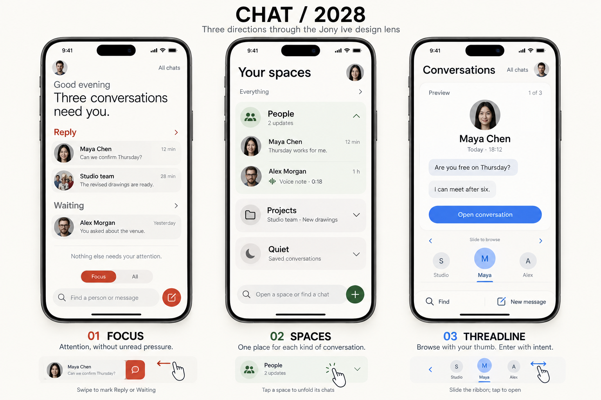
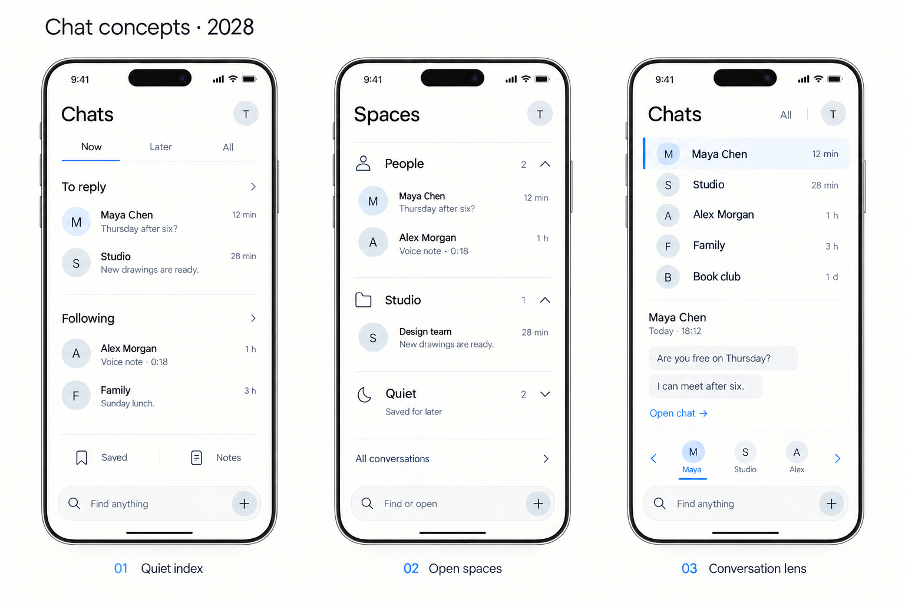
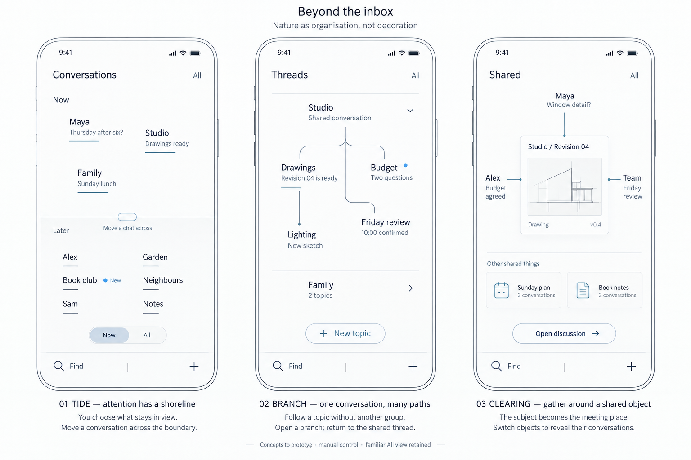
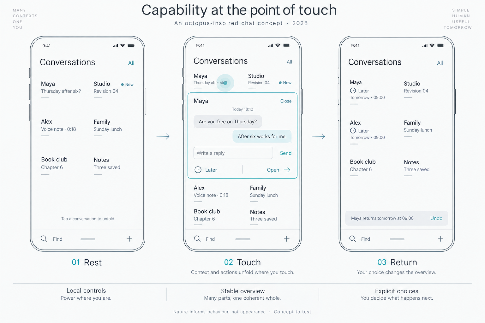
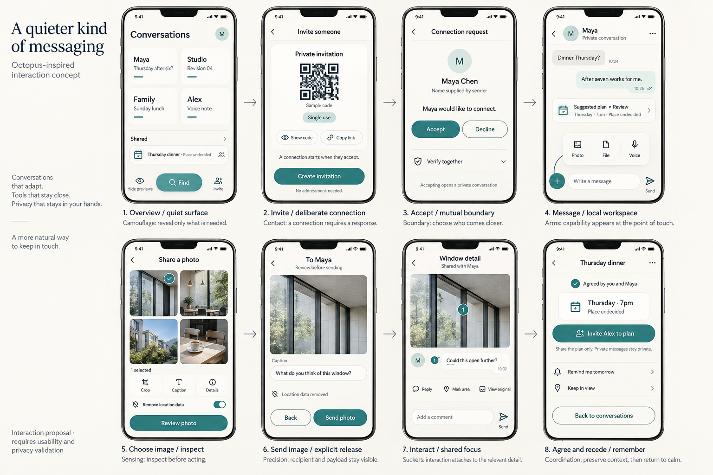
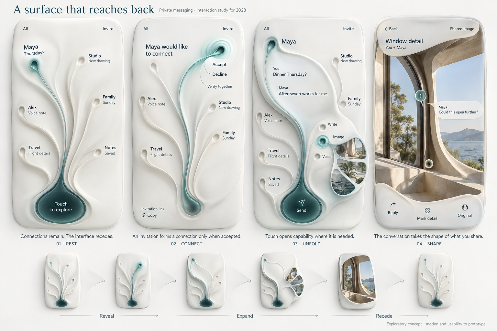
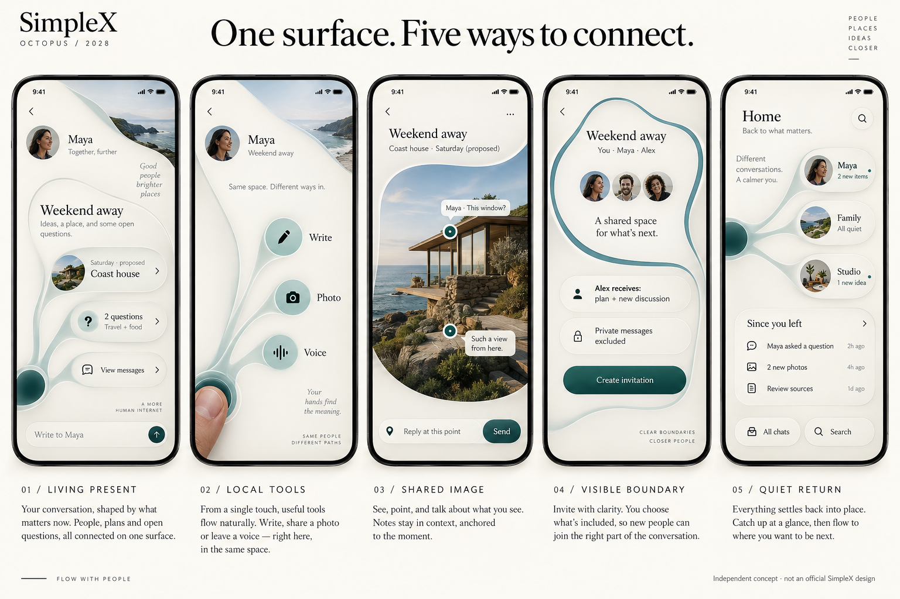

# The design journey — every step

## Start here: From anatomy to interface

A coordinating centre. Flexible arms. Local touch points.

This is the opening explanation for the project: how octopus anatomy suggested a different way to organise interaction. The mappings are design analogies, not a biological simulation or a production architecture.

The board was developed after several earlier sketches. We feature it first because it explains the idea; the record below preserves the actual progression rather than pretending this was the first image made.

## The visual iterations

### 1. Focus / Spaces / Threadline

**Question:** could we reduce attention pressure and make conversations easier to enter?
**Response:** prioritised replies, grouped spaces and conversation previews.
**Critique:** familiar messaging patterns with a new appearance did not establish a future interaction model.
**Next:** remove visual ego and simplify the structure.

### 2. Quiet index / Open spaces / Conversation lens

**Question:** what does organised, clean and generous with space mean in practice?
**Response:** quieter typography, fewer containers and clearer grouping.
**Critique:** cleaner, but still conventional; the user asked what actually made it modern or innovative.
**Next:** look outside the standard model and learn from nature.

### 3. Tide / Branch / Clearing

**Question:** could natural organisation change how people navigate?
**Response:** attention as a shoreline, conversation topics as branches, shared objects as gathering places.
**Critique:** useful organisation ideas, but no single anatomical model yet unified the experience.
**Next:** explore the octopus specifically: flexibility, local sensing and selective visibility.

### 4. Rest / Touch / Return

**Question:** could capability appear exactly where someone acts?
**Response:** touch a conversation to unfold a local workspace; let it return to an overview.
**Critique:** the behaviour began to change, but the anatomy was still hard to see.
**Next:** make the connection between anatomy and interaction explicit.

### 5. From anatomy to interface

**Question:** how could centre, arms and contact points become a coherent interface?
**Response:** a coordinating anchor, branching conversations and local tool points along an active arm.
**Critique:** the analogy was clearer, but eight visible branches were only a prototype constraint. Scaling and accessibility remained open.
**Next:** test a complete journey instead of only the menu.

The opening board above shows this iteration.

### 6. A quieter kind of messaging

**Question:** how does the idea cover invitations, messages, photos, image replies and agreements?
**Response:** an eight-screen end-to-end flow.
**Critique:** the journey was more complete, but remained a conventional series of screens. It did not yet deliver the flow, creativity or 2028 vision requested.
**Next:** explore a continuous sculptural surface.

### 7. A surface that reaches back

**Question:** what if the selected surface could reach, unfold and settle?
**Response:** Rest, Connect, Unfold and Share through supple folds and branching regions.
**Critique:** the direction became more expressive. It still needed readable navigation, reachable controls and a convincing interaction behind the appearance.
**Next:** connect the surface to five concrete messaging predictions.

### 8. One surface. Five ways to connect.

**Question:** how does each prediction become a usable design?
**Response:** living present, local tools, shared image, visible boundary and quiet return in one family.
**Critique:** curved outlines alone did not earn the form; participant and invitation details also required correction.
**Next:** follow the behaviour through a complete story and inspect the weak points.

### 9. A connection becomes a shared world

**Question:** can a relationship remain recognisable throughout the journey?
**Response:** invite, accept, write, choose, send, touch, gather and return, with a movement study.
**Critique:** the phone stayed rectangular and the UI still relied on pages and pills. The key unresolved question was continuity of behaviour.
**Next:** perfect one real opening/closing interaction, then extend it.

## The working iterations

### Shared messaging — early plan study

[Try the early shared-plan study](../prototypes/shared-plan.html).

Source messages become a proposal; the demo explores inviting Alex and a return reminder. Historical shortcuts automatically simulate recipient acceptance. This is useful process evidence, not the reference permission model.

### Your people — opening and closing

[Try the opening study](../prototypes/maya-opening.html).

The screenshot shown in the originating conversation belongs to this study. Touch Maya, write a draft, close and reopen. The same region expands and preserves the draft. Family and Studio are illustrative inactive entries.

### Your people — photo workspace

[Try the photo study](../prototypes/maya-photo.html).

Tools open locally, a selected image is reviewed before a simulated send, and a reply attaches to a point. The draft remains in place. Exact image-bound coordinate mapping still needs improvement when the preview is letterboxed.

### Combined experience

[Try the combined study](../prototypes/continuous-demo.html).

Invitations, plan membership, separate date decisions, source return and a labelled email scenario join the same environment. Real expansion origins, full reload restoration, large contact sets and production permissions remain unresolved.

### Combined experience — revision 02 / alignment and anatomy

The initiator’s browser screenshot exposed a clipped composer, a repeated message preview and an oversized expanding form. The [audit](PROTOTYPE_AUDIT.md) records the mismatch with the anatomy model. The revision adds a coordinating centre and distinct paths, contains the workspace inside one phone viewport, and scrolls tools within the active arm. Compare the [previous version](../prototypes/continuous-v1.html) with the [revised study](../prototypes/continuous-demo.html). Actual rendered previews replace the old combined preview; the conceptual boards remain historical references.

### One list, many conversations — menu study

The initiator asked for multiple messages in one list. The [working menu](../prototypes/menu-list.html) shows seven conversations, two message previews per conversation, search and All / Unread / Groups filters. A conversation opens locally and keeps an in-memory draft. It tests whether a familiar organising structure can support a different interaction journey. The evolutionary analogy informs behaviour; it does not require a radial menu. Next: compare this list with the coordinated-path home using the same tasks.

### List menu — continuity revision

One conversation now unfolds at a time while the surrounding list stays in place. Switching to another relationship closes the previous workspace without clearing its draft. Collapsed rows show a draft marker; recent-message previews update after a simulated send. The message history scrolls within the open region. Search and filters close a workspace that falls outside the results, preserving its draft. Keyboard and reduced-motion routes remain available. [See the actual open-menu screenshot](../visuals/previews/menu-list-open.png). Checks passed for one active workspace, switching/filter draft retention, draft markers, updated previews, keyboard controls, reduced motion and horizontal fit at 360, 390 and 1440 pixels. Compare the [first list study](../prototypes/menu-list-v1.html) with the [current menu](../prototypes/menu-list.html).

### V2 — five studies shaped by SimpleX

The initiator asked for the website palette, integration into the existing app, deeper research and application of privacy/QR concepts. [The five studies](../v2.html) now cover the list, deliberate invitation, profile privacy, trust review and group membership. Colour and behaviour changes are explained in [the research](SIMPLEX_RESEARCH.md) and [integration proposal](APP_INTEGRATION.md). The sample QR encodes a design-study marker; no real invitation, keys, delivery or authentication are implemented. Browser checks passed for all five studies at 360, 390 and 1440 pixels, light/dark appearance and the main simulated decision paths. Native feasibility, large-contact performance and participant testing remain open.

## What the record means

The critique above summarises the originating conversation; it is not user-study evidence. The opening analogy, visual generation order and working-prototype order are distinguished deliberately. All generated boards, all available working studies and the structural wireframes are linked from the [concept library](../concepts.html).

Next contributions should add the question, response, evidence, critique and resulting decision to this record. Preserve earlier directions rather than silently replacing them.
