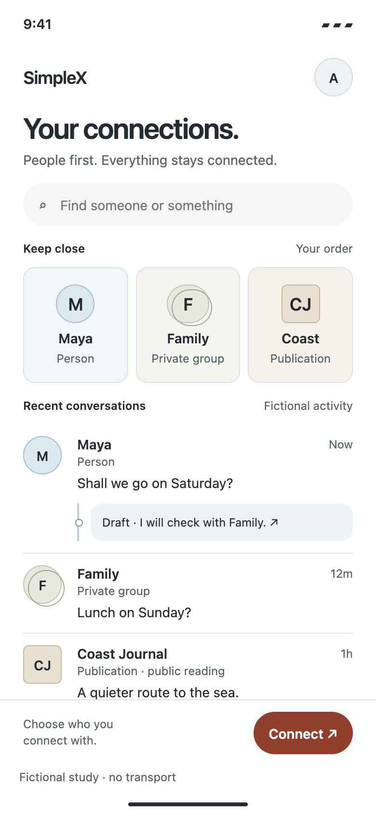

# Interactive menu journey — people, local tools, coherent return

10 October 2026. **[Try the interactive menu](../studies/menu-journey.html?mobile=1)** · [Context and full view](../studies/menu-journey.html). A separate exploration from the accepted single-image menu test. The current full-app candidate remains V2.1.2.3. Fictional contacts; no transport, cryptographic assurance, recording or durable storage.

## Every rendered state

| State | PNG | Behaviour |
| --- | --- | --- |
| Menu | [01](../studies/menu-journey-captures/01-menu.png) | Mixed people, private group, publication and provider; stable order and local search |
| Maya draft | [02](../studies/menu-journey-captures/02-maya-draft.png) | One open conversation; edit the unsent draft |
| Photo | [03](../studies/menu-journey-captures/03-photo.png) | Original SVG illustration unfolds beside its source |
| Local plan | [04](../studies/menu-journey-captures/04-local-plan.png) | Choose a fictional time locally |
| Review | [05](../studies/menu-journey-captures/05-review.png) | Exact suggestion, Maya as recipient, Austin as identity |
| Return | [06](../studies/menu-journey-captures/06-return.png) | Simulated reply plus retained draft and source focus |
| Family | [07](../studies/menu-journey-captures/07-family.png) | Named private group audience with an isolated draft |
| Coast Journal | [08](../studies/menu-journey-captures/08-publication.png) | Public reading; no private-reply composer |
| Prepare image | [09](../studies/menu-journey-captures/09-image-prepare.png) | Select a demo image and caption locally |
| Image review | [10](../studies/menu-journey-captures/10-image-review.png) | Exact image and caption; Maya as recipient, Austin as identity |
| Queue failure | [11](../studies/menu-journey-captures/11-image-failure.png) | Nothing queued; explicit retry retains review and draft |
| Simulated queue | [12](../studies/menu-journey-captures/12-image-queued.png) | One local receipt, with no server acceptance or delivery |

All PNGs are browser renders of original code with fictional test input and reduced motion. The photo is a clearly labelled code-drawn illustration, not a real photograph. Code MIT; original design material CC BY 4.0 under repository terms.

## Mobile brief and decisions

Mobile web communication experience for people switching between personal correspondence, small groups and publications. Ordinary touchscreen and desktop preview; no native platform support claimed. Main task: find a relationship, continue an unsent reply, explore a related object and return. Error risks: wrong audience, lost draft, confusing local selection with sending or group agreement. No permissions or real data are required.

A circle marks a person; overlapping circles mark a group; a 6 px rectangle marks a publication; a 12 px container marks a provider. Explicit type labels reinforce shapes, so colour is not the sole cue. White and subtle blue materials, oat publication surface, neutral text and clay actions preserve the owner's palette. No blue words. Controls use at least 44 CSS px, not native pt/dp. The mobile-app-ui-design skill was applied with the established project rules taking precedence over generic effects, avatar preferences and spacing prescriptions.

The menu opens **one conversation at a time**. “Unfolding” means the local photo/plan extends inside that open conversation, not several live chats inside a list. This follows research §10.1. The menu retains its scroll, origin and per-relationship drafts. Browser Back and in-app Back return through the same history. Back while a local tool is open saves the collapsed conversation reading position. Escape cancels a review first, then dismisses its task.

The source rail and contact point are subtle octopus tells. Their human purpose is to attach the task to its relationship. Identity and exact text appear at the action; the composer names the audience. A Family draft is separate from Maya's. A suggestion to Maya does not claim Family agreed. A publication never presents public reading as private messaging.

## Working and limited

The photo and plan are fixed local templates, not sender-supplied code or AI-generated interfaces. Only review confirmation creates a simulated text object; no delivery occurs. Repeating the same suggestion in this page cannot duplicate it. Closing a local tool restores its origin focus and thread position without rebuilding the composer. Search filters fictional entries locally. Connect opens the separate existing identity/connection study; it is not a new connection implementation.

All state is page memory. Reload clears it. Native keyboard reach, OS text scaling, background eviction, VoiceOver/TalkBack and physical touch have not been tested. No direct entity deep-link support is claimed. The per-instance duplicate rule is not production transport idempotency. These templates share JavaScript privileges and provide no security boundary or authenticated origin. The main menu can scroll; PNGs show the captured viewport, not every item at once.

## Validation

[40 browser checks](menu-journey-check.json) · [check/render script](../scripts/check-menu-journey.cjs). Headless Chrome at 320/390/768/1440 CSS px: entity differences, edited drafts, no-send choice/cancel, exact review, duplicate suppression, origin focus, menu scroll, isolated group draft, public reading, local search and reduced motion. Twelve phone renders. These show operation, not participant comprehension or a superior design.

The user asked for an interactive version after reviewing the main-menu image. This continues the explicit visual-exploration exception recorded 9 October. T05 and privacy gates remain open; it does not replace V2.1.2.3 or close Study A. Previous café workspace visuals are also preserved and published separately at [workspace.html](../studies/workspace.html).

## Octopus check

- **Rules:** Act locally; Return coherently.
- **From SimpleX foundations:** relationship context and deliberate sending; one open chat. No core integration.
- **From the analogy:** source-attached extension, local choice and withdrawal with useful context retained.
- **Tests:** edited draft survives photo/plan/home return; original focus/scroll return; choice/cancel create no simulated message. These checks cannot run on the pre-change build because this page is absent.
- **Research:** [Interfaces that arrive §9.1 F5/F7/F8/F11](RESEARCH_NOTES/INTERFACES_THAT_ARRIVE.md#91-principles), [§10.1 open-chat workspace](RESEARCH_NOTES/INTERFACES_THAT_ARRIVE.md#101-what-changes) and [§10.2 study sequence](RESEARCH_NOTES/INTERFACES_THAT_ARRIVE.md#102-sequence-of-studies).
- **Revise/drop if:** people cannot distinguish group/public audiences, misunderstand simulation, lose orientation on return or complete the same task more clearly in an ordinary chat.

## Attachment extension — 10 October 2026

In Maya, tap **＋ Image**. Choose Harbour or Coastal path, add an optional caption, replace the image, and review before **Simulate queue**. Editing or cancelling queues nothing. The attachment caption is separate from the conversation draft. A repeated image/caption pair is suppressed for this page instance; this is deliberately narrow study logic, not transport idempotency or a recommendation to block legitimate resends forever. Leaving the relationship discards an uncommitted attachment; it preserves the ordinary draft and completed simulation receipts. Clicking Image again resumes current preparation.

[Failure condition](../studies/menu-journey.html?mobile=1&queue=fail) makes the first attachment queue attempt fail locally, once. Retry requires an explicit tap on the retained exact review. No uncertain server outcome is modelled. Device permission, actual file selection, camera access, metadata removal, upload progress and server acceptance/delivery remain outside this exploration. **T09 remains open.** All state is lost on reload.

The client-authored preparation stays inside the conversation. Its origin is the composer; cancellation/completion restore that button and the captured thread position. This is local action and coherent return, with deliberate review in the named relationship. Research: Interfaces that arrive §9.1 F5/F8/F9 and §10.1. The old build fails the new test because Image is absent. Simplify or drop if people confuse the caption with the separate draft, mistake a local receipt for delivery, or find ordinary attachment preparation clearer. No new protocol or security claim is made.
