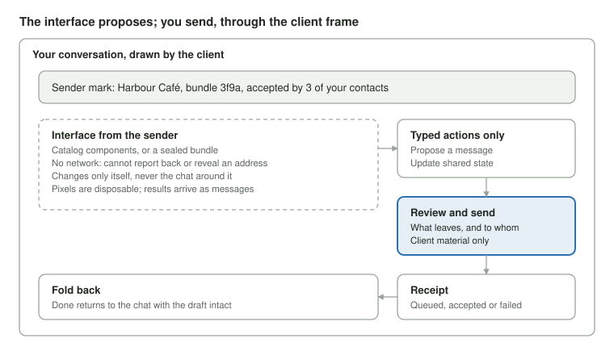

# Interfaces That Arrive

*Programmable interfaces, chat as an operating system, and the architecture of flow in an open messenger*

6 October 2026 · AustinWerner-KAI · Working paper for the From anatomy to interface study

## Abstract

Messaging is moving from preprogrammed screens to interfaces that arrive inside a conversation, made for one person in one moment. This paper asks what that shift demands of the chat client of an open, end-to-end encrypted network with no user identifiers and no central reviewer, using [SimpleX Chat](https://simplex.chat) as the case.

We combine a review of about 90 sources (adaptive and generative UI research from 1999 to 2026, fifteen protocols and platforms, and the history of chat as an operating system) with a direct reading of the SimpleX client code at commit `479548ee`. Three findings follow.

1. **The field has converged on two tiers.** Interface as data, rendered from a catalog the client owns, and interface as a sandboxed bundle the person accepts. Both mediate every outbound action through a small typed set.
2. **Provenance is unsolved.** No shipped system tells the viewer, reliably, who made a surface, what shaped it, what it can do, and that it is not the host. The problem is hardest without a reviewer.
3. **The client's core decides what can unfold where.** SimpleX's apps hold one open chat at a time, so a conversation unfolding inside the chat list needs the core rebuilt, while an interface unfolding inside a chat does not.

We propose **the frame**: a client-owned set of rules around any interface someone else's code or model renders in a private conversation. We derive it from the six flow rules of the octopus theory of design, and give a sequence of studies to evolve the SimpleX chat UI toward it.

## 1. Introduction

Messaging platforms are adding programmable interfaces: interfaces delivered inside a conversation, written for one person's situation, and sometimes written by a model, including AI prompts, contexts and skills that reply in interfaces. This paper takes that direction seriously for SimpleX and tests five propositions:

- Some tasks are too complex for a fixed app UI. An interface written for one person's situation, as part of a reply, can do better.
- Chat is becoming an operating system, and an app is a conversation with a custom interface.
- People still want grids, carousels and lists. These are not new, so the difficulty lies in execution quality, not in novel design.
- Scrolling through chats needs the chat core re-engineered, while a grid is a list organised differently.
- An open network, not a walled garden, is the differentiator. A common view holds that closed messengers will follow AOL and MSN.

Two references frame the discussion: [Discord's 2022 post on its app platform](https://discord.com/blog/welcome-to-the-new-era-of-discord-apps) and a video, [The Ridiculous Engineering Of Chat](https://www.youtube.com/watch?v=6DSW1rN-ZV4) by Enrico Tartarotti.

**Research question.** What must the chat client of an open, encrypted, identifier-free network get right to host interfaces that other people and models render for one person in one moment, and how should the [From anatomy to interface](https://github.com/AustinWerner-KAI/future-mobile-design-simplex-chat) study evolve to meet it?

**Contributions.**

1. A synthesis of research on per-person interface generation, from adaptive UI in the 1990s to generative UI in 2026 (section 4).
2. A map of fifteen protocols and platforms for interfaces in conversations, scored for fit with a reviewer-free encrypted network (section 5).
3. A test of the claim that closed messengers will fail as AOL did, against the historical record (section 6).
4. Evidence from the SimpleX client code for why scrolling through chats is a core problem (section 7).
5. The frame: design principles for interfaces made by others, derived from the octopus theory's six flow rules (sections 8 and 9).
6. A sequence of studies for the SimpleX chat UI (section 10).

## 2. Background: the octopus theory of design

The study's thesis is that **human relationships define what the interface contains, and the octopus theory informs how the experience flows.** The octopus followed a different evolutionary path from us. SimpleX has no user identifiers and keeps contacts on the device ([protocol overview](https://github.com/simplex-chat/simplexmq/blob/stable/protocol/overview-tjr.md)). If the foundations differ, the study asks, why should the interface follow the same path as WhatsApp and Telegram?

The analogy is held as an interaction hypothesis, not a biological or protocol claim. It licenses no eight-armed menus, no organic decoration and no claim that one animal is more evolved. It is expressed as six flow rules, each with its own test:

| Flow rule | Intended behaviour | Test |
| --- | --- | --- |
| Coordinate | A recognisable home connects the person to their entities and keeps them oriented | Can someone find an entity and return to where they were? |
| Act locally | Tools belong to the selected relationship or content, with source and audience visible | Can someone act without rebuilding the context? |
| Adapt the working space | The active task unfolds while its origin stays understandable | Does expansion help on a small screen and with a keyboard? |
| Retain useful state | Drafts and selections survive task changes, within stated limits | What survives back, cancel, switching and interruption? |
| Cross deliberately | Content reaches another audience only through a clear, intentional act | Can someone say exactly what is shared, with whom, by which transport? |
| Return coherently | Finishing or dismissing a task restores an understandable context | Is position, draft and outcome still clear? |

The study ran from nine concept boards on 3 October 2026 to version 2.1.2.3 on 6 October 2026, a browser runtime with three home candidates (grid, rail and collections), identity and profiles, public discovery, email channels, photo annotation and a home holding 120 conversations. Over 600 automated assertions hold its behaviour ([showcase](https://austinwerner-kai.github.io/future-mobile-design-simplex-chat/showcase.html)). No participant has yet used it.

Two results from that work matter here. The study's own audit judged that curved surfaces and strong colour do not make a new interaction model, and that a different evolutionary starting point does not prove a better experience. And a desk review mapped most of the study onto features SimpleX already has: the chat list mixes contacts, groups, business chats and channels; favourites and custom chat lists exist; group roles are real. The exceptions were email inside a business chat and proposals as shared objects, which have no protocol equivalent. Programmable interfaces turn both exceptions into interfaces delivered by the other side.

## 3. Method

The review drew on four parallel searches run on 6 October 2026, each reading primary sources where they could be reached:

1. **Literature:** peer-reviewed papers, preprints and theses on adaptive, model-based and generative UI, with foundational work from 1999 to 2014.
2. **Protocols and tools:** specifications, documentation and changelogs for fifteen systems that render interfaces in conversations or agents.
3. **Patterns and critique:** design-system guidance, pattern libraries, security research and accessibility research on generated interfaces.
4. **History:** the record of messengers that hosted apps, from AOL and MSN to WeChat, Telegram, Discord, Slack, iMessage, Messenger, Matrix, XMPP, Farcaster, Nostr and XMTP.

A fifth line read the [SimpleX client and core code](https://github.com/simplex-chat/simplex-chat/tree/479548ee53ffb73db73841e77acbeee5a78dbbd5) at commit `479548ee` (3 October 2026), with its git history, and compared it with public engineering material from Telegram, Signal, Discord, Slack, Matrix and Apple.

Every claim in sections 5 to 7 that rests on a number, a date or a line of code was checked a second time. The SimpleX code claims were verified line by line against a local copy. Eight load-bearing figures were re-fetched from their primary sources. That audit corrected eight statements before this paper was written: among them, an overstated count of screen-reader studies, an overstated timeline for SimpleX's scroll work, and a second-hand quotation replaced with the primary wording.

The two framing references were also examined. The Discord post dates from 24 May 2022 and concerns slash commands, buttons, select menus and ephemeral messages. The video's content could not be retrieved and is not relied on.

## 4. Related work: interfaces made for one person

Per-person interfaces are not new. What is new is that a language model can now perform the mappings that earlier systems could not automate.

### 4.1 Foundations, 1999 to 2014

[Horvitz (1999)](https://erichorvitz.com/uiact.htm) set principles for systems that act on their own: weigh the expected value of acting against the cost of being wrong, and let the person invoke, dismiss and repair. The [CAMELEON reference framework (Calvary, Coutaz et al., 2003)](https://iihm.imag.fr/en/publication/TCC03a/) gave four levels, from tasks and concepts through abstract and concrete UI to the final UI, with context defined as user, platform and environment. [UsiXML (Limbourg et al., 2004)](https://research.dial.uclouvain.be/handle/2078.5/47950) made it a declarative language, the ancestor of today's interface-as-data formats.

[Myers, Hudson and Pausch (2000)](https://kilthub.cmu.edu/articles/journal_contribution/Past_Present_and_Future_of_User_Interface_Software_Tools/6470303/1) explained why that generation of tools stalled: a high threshold, a low ceiling, unpredictable results and designers losing control of the final look. Their list is the right test for current claims.

The strongest early evidence for per-person interfaces came from accessibility. [SUPPLE (Gajos, Weld and Wobbrock, 2010)](https://kgajos.seas.harvard.edu/papers/gajos10supple-aij.pdf) generated interfaces from a measured model of each user. For people with motor impairments its interfaces were faster and preferred over the defaults. [Gajos et al. (2008)](https://kgajos.seas.harvard.edu/papers/kgajos-chi08-predictability.pdf) found that accuracy mattered more than predictability for adaptive interfaces. [Findlater and McGrenere (2004)](https://www.cs.ubc.ca/labs/edapt/papers/findlater2004.pdf) found that menus the person controlled beat menus that adapted themselves, and that adaptive menus were no faster than static ones. [Akiki, Bandara and Yu (2014)](https://oro.open.ac.uk/39809) surveyed the field and found little real-world evaluation and no shared measure of good adaptation.

### 4.2 Generative UI, 2023 to 2026

[Leviathan et al. (2026)](https://arxiv.org/abs/2604.09577) at Google showed that a current model, with the right prompt, tools and checks, produces a working interface for almost any request. Broken outputs fell from 60% on an older model to none on Gemini 3, and raters judged the results comparable to expert-built pages in about half of cases. The authors name hallucinated content inside a plausible interface as a critical failure. The work shipped as Dynamic View in the Gemini app ([Google Research](https://research.google/blog/generative-ui-a-rich-custom-visual-interactive-user-experience-for-any-prompt/)).

Academic systems point to a consistent set of patterns:

| Work | Contribution | Finding that matters |
| --- | --- | --- |
| [DynaVis (Vaithilingam et al., CHI 2024)](https://arxiv.org/abs/2401.10880) | Perform an edit, then leave a widget behind | 23 of 24 participants preferred it; generating a widget was more reliable than letting the model edit the artefact |
| [BISCUIT (Cheng et al., 2024)](https://arxiv.org/abs/2404.07387) | Short-lived interfaces between prompt and code | Experts found them in the way when their goal was clear |
| [Cao, Jiang and Xia (2025)](https://arxiv.org/abs/2503.04084) | Generate a task data model, map interfaces from it | The model, not the code, is the durable artefact |
| [TaskArtisan (Chen and Pavel)](https://arxiv.org/abs/2607.17394) | Composable generated widgets | Slower to set up, faster on repeat tasks; generated widgets felt final and hard to edit |
| [Elicitive UIs (Kim et al., CHI 2026)](https://arxiv.org/abs/2609.23642) | Preference marks inside the generated interface | 63% of preferences surfaced only after people saw a mark |
| [Maru (Kim et al., UIST 2026)](https://arxiv.org/abs/2608.25565) | A persistent information architecture across generations | Alignment held across sessions where the baseline collapsed |
| [Park et al. (CHI 2026)](https://arxiv.org/abs/2601.19171) | Norman's two gulfs applied to UI generation | Named semantic drift: successive edits pull a design from its intent |
| [Chen, J. et al. (2025)](https://arxiv.org/abs/2508.19227) | Generative interfaces versus chat | Preferred in most cases, but preference varied by domain |

Two essays frame the stakes. [Bernstein (2026)](https://arxiv.org/abs/2609.06770) argues designers become authors of generators rather than screens, and names inconsistency and learnability as the central objection. [Litt et al. (Ink & Switch, 2025)](https://www.inkandswitch.com/essay/malleable-software/) warn that code generation alone does not make software malleable: it cannot modify installed software, guarantee composition, or allow precise tweaks without code.

Practitioner guidance has followed. [Nielsen (2023)](https://jakobnielsenphd.substack.com/p/ai-is-first-new-ui-paradigm-in-60) called intent-based interaction the first new UI paradigm in 60 years. [Moran and Gibbons (2024)](https://www.nngroup.com/articles/generative-ui/) framed generative UI as a shift to outcome-oriented design, in which designers set constraints rather than draw screens. Design systems such as [IBM Carbon](https://carbondesignsystem.com/guidelines/carbon-for-ai/) and [AWS Cloudscape](https://cloudscape.design/gen-ai/patterns/) now publish patterns for marking and controlling generated content.

### 4.3 What the literature leaves open

- **Provenance.** None of the generative systems marks which parts of an interface are grounded and which are model-made.
- **Deception.** [Chen, Z. et al. (2026)](https://arxiv.org/abs/2502.13499) found that 55.8% of 1,296 model-generated e-commerce components contained at least one deceptive pattern, and business framing made it worse.
- **Accessibility.** None of the generative UI systems reviewed reports a screen-reader evaluation, and generated code fails most on ARIA and complex semantics ([Suh et al., 2025](https://arxiv.org/abs/2503.15885)).
- **Evaluation.** Most studies are single-session preference tests with 10 to 24 people. Designers themselves agree weakly, at Krippendorff's alpha 0.25, and models trained on one person's preferences beat pooled judges ([Peng, Bigham and Wu, 2025](https://arxiv.org/abs/2511.20513)).

## 5. The protocol landscape

By October 2026 the field had settled on two ways to put an interface inside a conversation: as data the client renders, or as a sandboxed app the person accepts. [Google Cloud](https://cloud.google.com/discover/generative-ui) names three levels of generation, and the trade-off between them is safety against flexibility:

| Level | What crosses the wire | Examples | Trade-off |
| --- | --- | --- | --- |
| Constrained | A tool call mapped to a hand-built component | Vercel AI SDK UI, Google AI Mode chips | Safe and consistent; little flexibility |
| Declarative | A description of components from a catalog the client owns | A2UI, json-render, OpenUI, Block Kit, Adaptive Cards, Discord components, Telegram Rich Messages | Nothing executable crosses; limited to the catalog |
| Open-ended | HTML, CSS and script | MCP Apps, ChatGPT apps, Gemini Dynamic View, Telegram Mini Apps, Discord Activities, webxdc | Unlimited; spoofing, leakage and script risk |

### 5.1 The systems

| System | UI model | Who writes the UI | Safety model | Open? |
| --- | --- | --- | --- | --- |
| [MCP Apps](https://github.com/modelcontextprotocol/ext-apps/blob/main/specification/2026-01-26/apps.mdx), stable 26 Jan 2026 | HTML in a sandboxed frame, messages over postMessage | Developer, template declared up front | Host-built content policy, separate origin, consent per server, every UI-initiated tool call mediated | Open specification |
| [ChatGPT apps](https://openai.com/index/introducing-apps-in-chatgpt/), Oct 2025 | MCP Apps plus vendor extras | Developer | Central review and directory | Protocol open, store closed |
| [A2UI](https://developers.googleblog.com/en/introducing-a2ui-an-open-project-for-agent-driven-interfaces/), v1.0 due late 2026 | Declarative components from a catalog the client advertises | Model at runtime | Nothing executable crosses; client validates and renders natively | Open, Apache 2.0 |
| [AG-UI 1.0](https://www.copilotkit.ai/blog/ag-ui-1.0), 30 Sep 2026 | Event stream that carries the other formats | Depends on payload | Delegates to payload | Open |
| [json-render](https://thenewstack.io/vercels-json-render-a-step-toward-generative-ui/) and [OpenUI](https://github.com/thesysdev/crayon) | Model output constrained to a catalog | Model | Catalog constraint | Open source |
| [Adaptive Cards](https://learn.microsoft.com/en-us/agents/design-guidelines/adaptive-cards-for-agent-design), [Block Kit](https://docs.slack.dev/changelog/2026/04/16/block-kit-new-blocks/), [Discord components](https://docs.discord.com/developers/components/reference) | Declarative, rendered natively | Developer | No script; admin or marketplace review | Vendor |
| [Telegram Mini Apps](https://core.telegram.org/bots/webapps) and [Rich Messages](https://core.telegram.org/bots/api-changelog) | Hosted web view; declarative blocks | Developer | Permission prompts, signed launch data | Vendor |
| [Matrix widgets](https://github.com/matrix-org/matrix-widget-api) | Hosted frame | Developer | Capabilities requested and approved per widget | Open, outside the stable spec since 2018 |
| [webxdc](https://webxdc.org/docs/), proposed for Matrix as [MSC4211](https://github.com/matrix-org/matrix-spec-proposals/pull/4211) | A bundled web app sent as a chat message, with no network | Developer, shared peer to peer | Offline sandbox; state syncs as encrypted messages | Open |
| [Apple App Intents snippets](https://developer.apple.com/videos/play/wwdc2026/343/) | Native views rendered by the system | Developer | Sandbox, store review, confirmation | Vendor |
| [Android AppFunctions](https://developer.android.com/ai/appfunctions) | No UI; typed data the agent renders | None | Privileged permission | Platform API |

### 5.2 Where it converges and where it splits

The field converges in three places. Hosted apps share one standard, MCP Apps, on which the earlier MCP-UI project and the ChatGPT Apps SDK now build. Most of what a model writes travels as data from a catalog. And chat platforms add native blocks for agents rather than handing them a web view.

It splits in four. Who writes the interface remains open: a developer ahead of time, a model within a catalog, or a model writing code. Several catalog formats reach version 1.0 in late 2026 with no clear winner. Protocols are open while distribution stays closed: every major host keeps a gatekeeper, and only Matrix widgets and webxdc run without one. And almost every system assumes a server that can read the content. **End-to-end encryption is unsolved in the mainstream protocols.**

### 5.3 Fit for a reviewer-free encrypted network

Two models fit SimpleX's constraints, and both remove the reasons a reviewer exists:

- **A bundle sent as a message**, in the shape of webxdc. It is signed by its sender, travels over the existing encrypted channel, and runs with no network. It cannot report back, track, or reveal the viewer's address. Its state syncs as further encrypted messages, and its provenance is its sender.
- **A declarative catalog**, in the shape of A2UI. Nothing executable crosses the wire, and the client decides what any control can do. It is the only form in which an interface written by a model is acceptable without review.

The mechanics of MCP Apps are worth reusing with the network turned off: declared templates, typed actions, host-checked messages and display modes. Three models fit poorly. Hosted web views reveal the viewer's network address and let the author change code after acceptance. Model-written code has no one to vouch for it. Store-reviewed models depend on a reviewer SimpleX does not have.

## 6. Chat as an operating system: the historical record

The record supports a narrower claim than "every walled messenger will fail". App layers inside closed messengers churn, and closed messengers fall when a specific set of conditions meets, which only some of them face.

### 6.1 The record

| Date | Event |
| --- | --- |
| Jan 2026 | Slackbot relaunches as an agent that reaches into other tools ([TechCrunch](https://techcrunch.com/2026/01/13/slackbot-is-an-ai-agent-now)) |
| Apr 2025 | Microsoft opens an agent store inside Copilot and Teams ([Microsoft](https://www.microsoft.com/en-us/microsoft-365/blog/2025/04/23/microsoft-365-copilot-built-for-the-era-of-human-agent-collaboration/)) |
| Feb 2025 | The Matrix Foundation needs $100,000 to keep its bridges running ([Matrix](https://matrix.org/blog/2025/02/crossroads/)) |
| Feb 2025 | Telegram requires crypto mini apps to move to its TON chain; developers call it anticompetitive ([Cointelegraph](https://cointelegraph.com/news/telegram-ton-wallet-mandate-crypto-mini-apps)) |
| Nov 2024 | Telegram Mini Apps 2.0: full screen, per-app location permission ([Telegram](https://telegram.org/blog/fullscreen-miniapps-and-more)) |
| Sep 2024 | Farcaster's new daily registrations fall 95.7% from their peak after mini-app spikes driven by speculation ([BlockEden](https://blockeden.xyz/blog/2025/10/28/farcaster-in-2025-the-protocol-paradox/)) |
| Mar 2024 | US Department of Justice cites iMessage lock-in in its complaint against Apple ([TechCrunch](https://techcrunch.com/2024/03/21/doj-claims-green-bubbles-are-an-issue-in-iphone-monopoly-suit/)) |
| Sep 2021 | Tencent agrees to let WeChat users open rivals' links after a regulatory order ([Euronews](https://www.euronews.com/2021/09/18/china-regulation-tencent)) |
| Feb 2020 | Facebook Messenger removes its Discover tab and demotes bots ([TechCrunch](https://techcrunch.com/2020/02/28/messenger-removes-discover)) |
| Mar 2017 | iMessage app growth stalls six months after launch ([TechCrunch](https://techcrunch.com/2017/03/16/six-months-in-imessage-app-store-growth-slows-as-developers-lose-interest/)) |
| Jan 2017 | WeChat Mini Programs launch ([TechCrunch](https://techcrunch.com/2017/01/09/wechat-mini-programs/)) |
| Apr 2016 | Messenger opens to bots at F8 ([Meta](https://about.fb.com/news/2016/04/messenger-platform-at-f8/)) |
| May 2013 | Google drops XMPP federation ([EFF](https://www.eff.org/deeplinks/2013/05/google-abandons-open-standards-instant-messaging)) |
| 1995 to 1996 | MSN launches as a closed service and pivots to the web within 15 months; AOL moves to flat-rate pricing ([MSN](https://en.wikipedia.org/wiki/The_Microsoft_Network), [AOL](https://en.wikipedia.org/wiki/AOL)) |

### 6.2 What successes and failures share

The successes (WeChat, Telegram, Slack, and Discord within games) shared four things. A reason to transact already lived inside the chat before apps arrived. The UI model fitted the host. Discovery happened inside conversations, through QR codes, links and in-channel launchers. And each stayed narrow where the host was strong.

The failures (Messenger bots, iMessage apps, Farcaster's growth phase, XMPP as a platform) shared the opposite. Discovery was buried: iMessage apps took four taps to reach. There was no payments case. The interaction model did not fit the task. Demand was speculative. And open protocols leaned on one large participant. Whether XMPP fell because Google left in 2013 is disputed; Gruber argues it was doomed by the shift to mobile messaging regardless ([Daring Fireball](https://daringfireball.net/linked/2023/06/26/xmpp-google)).

### 6.3 The AOL thesis, tested

AOL fell through three specific mechanisms ([AOL](https://en.wikipedia.org/wiki/AOL)). It shipped its own substitute, a web browser, inside its service. Flat pricing removed the metering that paid for exclusive content. And broadband made its access business worthless. None of the three applies to WeChat, iMessage or WhatsApp, whose lock-in is the social graph rather than an access account. WeChat reported 1.41 billion monthly users in mid-2025 ([Tencent](https://www.prnewswire.com/apac/news-releases/tencent-announces-2025-second-quarter-results-302528863.html)) and RMB 2 trillion through mini programs in the third quarter of 2024 alone ([36Kr](https://eu.36kr.com/en/p/3116603121684483)). iMessage's lock-in survived a decade in which its app platform faded ([Computerworld](https://www.computerworld.com/article/1680116/hard-times-inside-apples-forgotten-app-store.html)). Commentators dispute the analogy outright ([Martinez, Zócalo Public Square](https://live-zocalopublicsquare.ws.asu.edu/?p=16169)).

The closest thing to AOL's browser moment is the AI agent becoming the shell, as Microsoft, Slack and Discord now attempt. An agent that does the work makes third-party apps redundant, as the browser made AOL's content redundant. That is the bet an open, programmable messenger would make. It is a hypothesis, not yet evidence.

### 6.4 Lessons for an open network

1. **Discovery lives in conversations,** not in a store.
2. **Any directory is one of many,** each signed by its curator. Telegram's optional store is the right shape; its TON mandate is the warning.
3. **Social trust replaces review.** Nostr's [NIP-89](https://github.com/nostr-protocol/nips/blob/master/89.md) recommends apps by "people you follow". The honest signal on SimpleX is contacts who have already accepted an interface.
4. **The interface contract belongs in the core specification from day one.** Matrix widgets have stayed outside the stable spec for eight years and have worked in practice mainly in one client, Element.
5. **Decide the payment rail early.** Apps followed payment rails in WeChat and Telegram, and whoever controls the rail ends up controlling the apps.

## 7. The engineering constraint: scrolling through chats

The proposition holds, and the SimpleX code shows where. A chat list of previews is cheap because it is already in memory. Showing the contents of more than one chat at once breaks the client's central assumption: **one open chat at a time.**

### 7.1 What the phrase means

"Scrolling through the chats" most plausibly means several chats' messages open and live inside one scroll, which is what a conversation unfolding in the list does. Its extreme form is one continuous feed of messages from many chats. Both differ in kind from rearranging the list, which is all a grid, a group or a filter does.

### 7.2 What the code shows

All references are to [commit 479548ee](https://github.com/simplex-chat/simplex-chat/tree/479548ee53ffb73db73841e77acbeee5a78dbbd5).

- **One message buffer.** The iOS app holds one shared items model plus one secondary model used for group support and reports ([ChatModel.swift](https://github.com/simplex-chat/simplex-chat/blob/479548ee53ffb73db73841e77acbeee5a78dbbd5/apps/ios/Shared/Model/ChatModel.swift), lines 74 to 75). Android and desktop mirror it.
- **Events reach the open chat only.** An incoming message enters a buffer only if it belongs to the open chat; every other chat updates its preview (`getCIItemsModel`, line 695).
- **One draft.** The app keeps one draft, behind a privacy setting, and the core stores none (lines 431 to 433).
- **Per-chat indexes.** Every time-ordered index on messages is keyed by chat, and there is no full-text index ([schema](https://github.com/simplex-chat/simplex-chat/blob/479548ee53ffb73db73841e77acbeee5a78dbbd5/src/Simplex/Chat/Store/SQLite/Migrations/chat_schema.sql)). Direct chats order by creation time and groups by item time, so a merged feed would need to reconcile two clocks.
- **A cheap list.** Both apps request the chat list without pagination and receive up to 5,000 previews in one call.
- **An unused cross-chat query.** The core has had an all-chats message query since 2023, but no app calls it, and it loads each item separately.

The history confirms the cost. Opening one chat at its first unread message took about six months of core and app work, from a [pagination API in November 2024](https://github.com/simplex-chat/simplex-chat/pull/5100) to a [2,177-line iOS change in February 2025](https://github.com/simplex-chat/simplex-chat/pull/5392) and follow-up fixes into April. The [v6.2 release notes](https://simplex.chat/blog/20241210-simplex-network-v6-2-servers-by-flux-business-chats.html) call it a long-standing complaint.

### 7.3 How others do it

Every messenger checked keeps the list light and loads content for one chat at a time. Telegram pages one chat's history at up to 100 messages ([TDLib](https://core.telegram.org/tdlib/docs/classtd_1_1td__api_1_1get_chat_history.html)). Slack fetches only the active channel ([Slack Engineering](https://slack.engineering/making-slack-faster-by-being-lazy/)). Discord rebuilt its own list component in 2025 to stop blank frames ([Discord](https://discord.com/blog/supercharging-discord-mobile-our-journey-to-a-faster-app)). Matrix rebuilt its room list after finding its sync scaled badly with room count ([MSC3575](https://github.com/matrix-org/matrix-spec-proposals/pull/3575)). iMessage pins only rearrange the list ([Apple](https://www.apple.com/newsroom/2020/06/apple-reimagines-the-iphone-experience-with-ios-14/)). The one shipped view of content across conversations found is [Slack's Unreads](https://slack.com/help/articles/226410907-View-all-your-unread-messages), and Slack has a server doing the work. WhatsApp and Signal iOS were not checked.

### 7.4 What each behaviour costs

| Behaviour | Cost on today's core | Why |
| --- | --- | --- |
| Grid, rail or collections home | Cheap | Rearranges previews already in memory |
| Grouping by time, unread filter, favourites, collections | Cheap | All exist in the core |
| A home of 100 or more chats | Cheap | The apps already load up to 5,000 previews |
| Two or three messages per row | Moderate | One small extra load per row |
| Unread digest grouped by chat | Moderate | One load per chat; replying opens the chat |
| Next unread chat at the end of a chat | Moderate | Reuses the single open chat |
| Global message search | Moderate | The query exists but is unused and unindexed |
| A conversation unfolding inside the list | Core rebuild | Several live buffers, event routing, nested lists, read marking across chats |
| Continuous scroll across chats | Core rebuild | A new index, one clock, merged paging, read state per item |
| Drafts and positions kept for many chats | Core rebuild | One draft today; no stored position per chat |

The most expensive behaviour is the study's founding gesture: Board 4, "Rest, Touch, Return", a conversation unfolding in place. The current runtime already avoids it, since conversations open with a slide rather than unfolding in the list.

## 8. Trust, provenance and accessibility

When someone else's code or model renders a surface inside a private conversation, the viewer needs six answers. Current systems give partial answers to two, a conditional answer to one, and none to the other three.

### 8.1 Six questions the viewer needs answered

| Question | Current practice | Status |
| --- | --- | --- |
| Who made this surface? | Consent per server. The [MCP Apps specification](https://github.com/modelcontextprotocol/ext-apps/blob/main/specification/2026-01-26/apps.mdx) gives no guidance on showing identity to people | Unsolved |
| Was it generated, and from what? | AI labels ([IBM Carbon](https://carbondesignsystem.com/guidelines/carbon-for-ai/)). The EU AI Act requires disclosure and machine-readable marking from 2 August 2026, with systems already on the market given until 2 December 2026 for marking ([Goodwin](https://www.goodwinlaw.com/en/insights/publications/2026/08/alerts-technology-dpc-eu-ai-act-transparency-obligations-now-in-force)) | Partial |
| Was the content that shaped it trusted? | A compromised agent renders a calm, coherent interface that is itself the attack ([Brave](https://brave.com/blog/unseeable-prompt-injections/)). OpenAI said in December 2025 that prompt injection is unlikely ever to be fully solved ([Fortune](https://fortune.com/2025/12/23/openai-ai-browser-prompt-injections-cybersecurity-hackers/)) | Unsolved |
| Where do my actions go, and on whose authority? | Mediated tool calls and consent per call. The danger is private data, untrusted content and outside communication in one place ([Willison](https://simonwillison.net/2025/Jun/16/the-lethal-trifecta/)) | Partial |
| Is this the host, or an imitation? | Sandbox boundaries and blocked system dialogs. The MCP Apps specification concedes that sandboxed UI can still display misleading content | Unsolved: a sandbox stops escape, not deception |
| Does rendering alone leak anything? | Image links in rendered output have leaked data from several products without a click ([Willison](https://simonwillison.net/tags/markdownexfiltration/); [OWASP LLM05](https://genai.owasp.org/llmrisk/llm052025-improper-output-handling/)) | Solved only by no network from rendered content |

The generator will not supply honesty on its own. Transparency scored lowest of five dimensions for all 14 models in one 2026 benchmark ([Wu et al.](https://arxiv.org/html/2607.28439)), and over half of generated shopping components carried deceptive patterns ([Chen, Z. et al.](https://arxiv.org/abs/2502.13499)). People are fooled too: in one study, humans as well as agents missed injected fine print ([Chen, C. et al., 2025](https://arxiv.org/abs/2504.11281)). **The client has to enforce it.**

### 8.2 Accessibility

- **Streaming breaks live regions.** Announcing a streamed reply token by token repeats it; suppressing it skips changes. The fix is to keep the transcript silent and announce short status messages from a separate element, as [WCAG 2.2 success criterion 4.1.3](https://www.w3.org/WAI/WCAG22/Understanding/status-messages.html) describes.
- **Dynamic change disorients.** [TIMESTUMP (ICSE 2025)](https://seal.ics.uci.edu/publications/2025_ICSE_timestump.pdf) names content that appears late, disappears, lives briefly, moves or changes. Blind testers confirmed 25 of 30 sampled issues. Every generated or regenerated component is one of these.
- **Generated code fails on semantics.** Models handle contrast and alternative text but not ARIA, and a checker in the loop fixes what prompting does not ([Suh et al., 2025](https://arxiv.org/abs/2503.15885)).
- **The one study with screen-reader users** restructured existing pages rather than generating new interfaces; people preferred it, though some regenerated pages lost links and buttons ([Yu et al., 2025](https://arxiv.org/abs/2502.18701)).
- **The debate is unresolved.** [Nielsen](https://jakobnielsenphd.substack.com/p/accessibility-generative-ui) argued that per-person interfaces are how disabled users are really helped. [Roselli](https://adrianroselli.com/2024/03/jakob-has-jumped-the-shark.html) replied that this requires detecting disability and risks separate but unequal experiences.

Rendering through native components from a catalog is the only approach with a structural answer: every interface inherits the client's tested accessibility.

## 9. A framework: the frame

We define **the frame** as the set of client-owned rules around any interface that someone else's code or model renders inside a private conversation. The interface may propose. Only the person sends, and only through the frame.

*Figure 1. The frame: one interface, five client-owned parts.*

The sender's interface sits inside a dashed boundary with no network. Every action it takes is typed, passes through a review the client draws, ends in a receipt, and folds back to the conversation.

### 9.1 Principles

Each principle maps to a flow rule from section 2 and rests on evidence from sections 4 to 8.

| # | Principle | Flow rule | Evidence |
| --- | --- | --- | --- |
| F1 | An interface is a message from a sender: signed, hashed, and blocked along with its sender | Coordinate | [webxdc](https://webxdc.org/docs/); [NIP-89](https://github.com/nostr-protocol/nips/blob/master/89.md) |
| F2 | A sender mark is always visible and opens a layered explanation: who sent it, what it can do, what it touched | Coordinate | [IBM Carbon](https://carbondesignsystem.com/guidelines/carbon-for-ai/); [HAX](https://www.microsoft.com/en-us/haxtoolkit/library/pattern/) |
| F3 | The client owns the boundary. Interfaces never wear client material such as the review step or system dialogs | Cross deliberately | [MCP Apps](https://github.com/modelcontextprotocol/ext-apps/blob/main/specification/2026-01-26/apps.mdx) |
| F4 | No network from interface content | Cross deliberately | [webxdc](https://webxdc.org/docs/); [Willison](https://simonwillison.net/tags/markdownexfiltration/) |
| F5 | Typed actions only. An interface proposes a message; the person sends it | Act locally | [MCP Apps](https://github.com/modelcontextprotocol/ext-apps/blob/main/specification/2026-01-26/apps.mdx); [Willison](https://simonwillison.net/2025/Jun/16/the-lethal-trifecta/) |
| F6 | Anything that leaves passes a plan, a confirmation and a receipt | Cross deliberately | [Nielsen](https://jakobnielsenphd.substack.com/p/intent-ux); [HAX](https://www.microsoft.com/en-us/haxtoolkit/library/pattern/) |
| F7 | An interface changes only itself, never the conversation around it | Act locally | [Park et al.](https://arxiv.org/abs/2601.19171) |
| F8 | Inline by default, full screen on request, and always folding back with the draft intact | Adapt the working space; return coherently | Section 2; [MCP Apps](https://github.com/modelcontextprotocol/ext-apps/blob/main/specification/2026-01-26/apps.mdx) |
| F9 | Pixels are disposable; what an interface produces arrives as a message | Retain useful state | [Cao et al.](https://arxiv.org/abs/2503.04084); [CAMELEON](https://iihm.imag.fr/en/publication/TCC03a/) |
| F10 | Leave a control behind, and show options to recognise rather than prompts to describe | Act locally | [DynaVis](https://arxiv.org/abs/2401.10880); [Elicitive UIs](https://arxiv.org/abs/2609.23642) |
| F11 | Adaptable, not adaptive: nothing rearranges the person's home on its own | Coordinate | [Findlater and McGrenere](https://www.cs.ubc.ca/labs/edapt/papers/findlater2004.pdf) |
| F12 | Capabilities are requested at the moment of use and remembered per sender and bundle | Cross deliberately | [Matrix widgets](https://github.com/matrix-org/matrix-widget-api); [Telegram](https://telegram.org/blog/fullscreen-miniapps-and-more) |
| F13 | Trust is social: show how many of the person's contacts accepted the interface | Coordinate | [NIP-89](https://github.com/nostr-protocol/nips/blob/master/89.md) |
| F14 | Anything a model writes renders from the client catalog, and state is announced separately from content | Return coherently | [A2UI](https://developers.googleblog.com/en/introducing-a2ui-an-open-project-for-agent-driven-interfaces/); [WCAG 4.1.3](https://www.w3.org/WAI/WCAG22/Understanding/status-messages.html) |

### 9.2 What the frame is not

The frame is not a review process. It cannot tell a good interface from a harmful one, and it does not try. It makes the consequences of any interface visible and reversible, and removes the channels that do harm without the person's action: the network, imitation of the client, and silent sending. That is the most an open network without a reviewer can promise, and it is more than closed platforms promise today.

## 10. Implications for the SimpleX chat UI

The study should stop designing fixed tools and start designing the frame they arrive in. Its next design study is "a conversation renders its own interface". It comes after the real-phone comparison (T05), because the study's working rule is research before polish: nothing in the prototype has yet been tested with a person, and the frame should not be the first thing that is.

### 10.1 What changes

| Today | Next |
| --- | --- |
| Email tab inside a business chat, marked speculative | The business replies with an interface; the client frames it |
| Proposal tool, with no protocol equivalent | A friend's or a model's interface proposes a plan; the result is a message |
| Photo pins as a fixed tool | Kept; it already follows the frame (anchored, attributed, listed in text) |
| A conversation unfolding inside the list | Retired as the default gesture. The interface unfolds inside the open chat |
| Novelty claimed from the surface | Grids, carousels and lists, judged on execution |

### 10.2 Sequence of studies

1. **Ask the SimpleX maintainers seven questions at once.** The five already written for T20, plus two from this paper: which interface model, if any, SimpleX would adopt (catalog, bundle, model-written, or a mix), and which core work it would consider (several live chats, or a merged timeline). The Discord reference concerns buttons, menus and slash commands, the catalog tier, which is a clue rather than an answer. Settle the three open decisions in section 10.4 at the same time, since Study A depends on them.
2. **Run the real-phone comparison (T05) first.** Six to nine participants and their own phones, reporting counts rather than percentages. Add one measure to the existing protocol: the home at 120 conversations against a plain list, same task, so that "execution over novelty" is tested rather than asserted.
3. **Study A: a conversation renders its own interface.** A business replies to a booking question with an interface, and in a second condition a model does. Both arrive through the same frame. Show the sender mark, the client-owned boundary, typed actions, a review before anything leaves, a receipt, and the fold back to the conversation with the draft intact. Measure it with checks that fail on the version without the frame.
4. **Study B: spoofing.** An interface tries to look like the client's own review step. Test whether people tell them apart with the frame and without it.
5. **Study C: trust without a store.** Compare a first-seen interface with one already accepted by three contacts. Ask what people believe each one can do.
6. **Study D: accessibility.** Run studies A to C with a screen reader and at 200% text size. Announce state from a separate status element.
7. **Write the core specification.** Turn the cost table in section 7.4 into a specification the maintainers could act on, and send it with the answers to step 1 in hand. It is a document, not a version of the prototype.
8. **Second real-phone round.** Add one interface task to the T05 protocol and run it again with the same participant count. Only after this round is the frame named as a version.

### 10.3 What to stop claiming

Record in the repository which behaviours are cheap on today's core and which depend on core work (section 7.4). Do not present a conversation unfolding inside the list as "just design". Do not present the home at scale as solving scrolling through chats; it solves a long list of previews, which is the cheap problem.

### 10.4 Decisions this paper does not make

- Whether a shared detail reveals its source. The study's design reveals it, while SimpleX forwarding hides the source by design. This needs deciding with the maintainers.
- Where payments live, if anywhere, in an interface.
- Whether persistence of interface state belongs on the device at all, given that the client keeps drafts and scroll position in memory only today.

## 11. Limitations and threats to validity

- **No participant evidence.** Nothing in the study or this paper has been tested on a person. Every design claim is a hypothesis until T05 and studies A to D run.
- **Desk research.** The review relied on research agents reading sources, then a second check of load-bearing figures. About a quarter of roughly 90 sources were not individually re-checked. Some 2026 venue years and preprint identifiers did not cross-check cleanly and are cited as published online.
- **Recency.** Many protocols changed within the last twelve months, and several reach version 1.0 after this paper. Section 5 is a snapshot as of 6 October 2026.
- **No public roadmap.** No public SimpleX statement on programmable interfaces was found. Where this paper discusses SimpleX adopting them, it describes a design direction for the study, not a SimpleX plan.
- **Unreviewed evidence.** The video cited in section 1 could not be retrieved, so any argument it makes is absent here.
- **Partial code reading.** The SimpleX code was read at one commit, and the iOS app more closely than Android. The cost ratings in section 7.4 are engineering estimates, not measurements.
- **Partial comparison.** WhatsApp and Signal iOS were not checked for how they load chats.
- **Practitioner and blog sources.** Some pattern and accessibility advice comes from design-system documentation and personal blogs. Where a standard exists, such as WCAG, it is cited first.

## 12. Conclusion and open questions

The shift to interfaces that arrive inside conversations does not replace the octopus theory. It gives it a job. When other people and models draw the tools, the designer of an open messenger draws the frame: who sent this, what it can do, what leaves, and how the person returns. The six flow rules already describe that frame. SimpleX's core, built around one open chat at a time, favours interfaces that unfold inside a chat over chats that unfold inside a list. The study should evolve along that line, test it with people, and leave novelty of surface to execution.

Open questions:

1. Which interface model, if any, would SimpleX adopt: catalog, bundle, model-written, or a mix?
2. How does a person tell a peer's interface from one their own local model wrote?
3. What is an honest quality signal on a network with no store?
4. How can AI contexts and skills that reply in interfaces disclose what they read, on a network that cannot audit them?
5. Can a catalog guarantee screen-reader behaviour for interfaces nobody reviewed?
6. How should a study test an interface that is different for every participant?

## References

All sources were accessed on 6 October 2026.

### Research

- Akiki, P., Bandara, A. and Yu, Y. (2014). [Adaptive model-driven user interface development systems](https://oro.open.ac.uk/39809). ACM Computing Surveys 47(1).
- Bernstein, M. S. (2026). [The Interface of Theseus: the rise of just-in-time interfaces](https://arxiv.org/abs/2609.06770). UIST Adjunct 2026.
- Calvary, G., Coutaz, J. et al. (2003). [A reference framework for the development of plastic user interfaces](https://iihm.imag.fr/en/publication/TCC03a/). IIHM, Grenoble. The framework is known as CAMELEON.
- Cao, Y., Jiang, P. and Xia, H. (2025). [Generative and malleable user interfaces with generative and evolving task-driven data model](https://arxiv.org/abs/2503.04084). arXiv.
- Chen, C. et al. (2025). [The obvious invisible threat: LLM-powered GUI agents' vulnerability to fine-print injections](https://arxiv.org/abs/2504.11281). arXiv.
- Chen, J., Zhang, Y., Zhang, Y., Shao, Y. and Yang, D. (2025). [Generative interfaces for language models](https://arxiv.org/abs/2508.19227). arXiv.
- Chen, M. and Pavel, A. (n.d.). [TaskArtisan: designing composable generative widgets for LLM-assisted analysis](https://arxiv.org/abs/2607.17394). CHI.
- Chen, Z., Shen, J., Luna, Zhang, H. and Vaccaro, K. (2026). [Deception at scale: deceptive designs in 1K LLM-generated ecommerce components](https://arxiv.org/abs/2502.13499). ACM.
- Cheng, R., Barik, T., Leung, A., Hohman, F. and Nichols, J. (2024). [BISCUIT: scaffolding LLM-generated code with ephemeral UIs](https://arxiv.org/abs/2404.07387). arXiv.
- Findlater, L. and McGrenere, J. (2004). [A comparison of static, adaptive, and adaptable menus](https://www.cs.ubc.ca/labs/edapt/papers/findlater2004.pdf). CHI 2004.
- Gajos, K., Everitt, K., Tan, D., Czerwinski, M. and Weld, D. (2008). [Predictability and accuracy in adaptive user interfaces](https://kgajos.seas.harvard.edu/papers/kgajos-chi08-predictability.pdf). CHI 2008.
- Gajos, K., Weld, D. and Wobbrock, J. (2010). [Automatically generating personalized user interfaces with SUPPLE](https://kgajos.seas.harvard.edu/papers/gajos10supple-aij.pdf). Artificial Intelligence 174.
- Horvitz, E. (1999). [Principles of mixed-initiative user interfaces](https://erichorvitz.com/uiact.htm). CHI 1999.
- Kim, E., Xia, H., Min, B. and Kim, J. (2026). [Elicitive user interfaces: designing how users shape generative interfaces](https://arxiv.org/abs/2609.23642). CHI 2026.
- Kim, E. et al. (2026). [Maru: information architecture as a shared language for generating aligned and persistent user interfaces](https://arxiv.org/abs/2608.25565). UIST 2026.
- Leviathan, Y., Valevski, D. et al. (2026). [Generative UI: LLMs are effective UI generators](https://arxiv.org/abs/2604.09577). arXiv. Companion post: [Google Research](https://research.google/blog/generative-ui-a-rich-custom-visual-interactive-user-experience-for-any-prompt/).
- Limbourg, Q. et al. (2004). [UsiXML: a language supporting multi-path development of user interfaces](https://research.dial.uclouvain.be/handle/2078.5/47950). EHCI/DSV-IS 2004.
- Litt, G., Horowitz, J., van Hardenberg, P. and Matthews, T. (2025). [Malleable software: restoring user agency in a world of locked-down apps](https://www.inkandswitch.com/essay/malleable-software/). Ink & Switch.
- Mehralian, F., He, Z. and Malek, S. (2025). [Automated accessibility analysis of dynamic content changes on mobile apps](https://seal.ics.uci.edu/publications/2025_ICSE_timestump.pdf). ICSE 2025.
- Myers, B., Hudson, S. and Pausch, R. (2000). [Past, present, and future of user interface software tools](https://kilthub.cmu.edu/articles/journal_contribution/Past_Present_and_Future_of_User_Interface_Software_Tools/6470303/1). ACM TOCHI 7(1).
- Park, S. et al. (2026). [Bridging gulfs in UI generation through semantic guidance](https://arxiv.org/abs/2601.19171). CHI 2026.
- Peng, Y.-H., Bigham, J. P. and Wu, J. (2025). [DesignPref: capturing personal preferences in visual design generation](https://arxiv.org/abs/2511.20513). arXiv.
- Suh, H., Tafreshipour, M., Malek, S. and Ahmed, I. (2025). [Human or LLM? A comparative study on accessible code generation capability](https://arxiv.org/abs/2503.15885). arXiv.
- Vaithilingam, P., Glassman, E., Inala, J. P. and Wang, C. (2024). [DynaVis: dynamically synthesized UI widgets for visualization editing](https://arxiv.org/abs/2401.10880). CHI 2024.
- Wu, Z., Luo, Y., Zhang, P., Yang, C. and Zhang, Z. (2026). [Beyond a single judge: the evidence-grounded, social-weighted persona panel for generative UI evaluation](https://arxiv.org/html/2607.28439). arXiv.
- Yu, Y., Ryskeldiev, B., Tsutsui, A., Gillingham, M. and Wang, Y. (2025). [LLM-driven optimization of HTML structure to support screen reader navigation](https://arxiv.org/abs/2502.18701). arXiv.

### Protocols and platforms

- [A2UI: an open project for agent-driven interfaces](https://developers.googleblog.com/en/introducing-a2ui-an-open-project-for-agent-driven-interfaces/). Google, December 2025.
- [AG-UI 1.0](https://www.copilotkit.ai/blog/ag-ui-1.0). CopilotKit, 30 September 2026.
- [Adaptive Cards for agent design](https://learn.microsoft.com/en-us/agents/design-guidelines/adaptive-cards-for-agent-design). Microsoft.
- [Android AppFunctions](https://developer.android.com/ai/appfunctions). Google.
- [Explore advanced App Intents features for Siri and Apple Intelligence](https://developer.apple.com/videos/play/wwdc2026/343/). Apple, June 2026.
- [New Block Kit blocks and Streaming API method updates](https://docs.slack.dev/changelog/2026/04/16/block-kit-new-blocks/). Slack, 16 April 2026.
- [Discord components reference](https://docs.discord.com/developers/components/reference). Discord.
- [Generative UI](https://cloud.google.com/discover/generative-ui). Google Cloud.
- [Introducing apps in ChatGPT](https://openai.com/index/introducing-apps-in-chatgpt/). OpenAI, 6 October 2025.
- [Vercel's json-render: a step toward generative UI](https://thenewstack.io/vercels-json-render-a-step-toward-generative-ui/). The New Stack, 23 January 2026.
- [Matrix widget API](https://github.com/matrix-org/matrix-widget-api) and [MSC4211: WebXDC on Matrix](https://github.com/matrix-org/matrix-spec-proposals/pull/4211). Matrix.
- [MCP Apps specification, 2026-01-26](https://github.com/modelcontextprotocol/ext-apps/blob/main/specification/2026-01-26/apps.mdx). Model Context Protocol.
- [OpenUI](https://github.com/thesysdev/crayon). Thesys.
- [Telegram Mini Apps](https://core.telegram.org/bots/webapps) and [Bot API changelog](https://core.telegram.org/bots/api-changelog). Telegram.
- [webxdc documentation](https://webxdc.org/docs/). webxdc.

### Practice, security and accessibility

- [Carbon for AI](https://carbondesignsystem.com/guidelines/carbon-for-ai/). IBM.
- [Generative AI patterns](https://cloudscape.design/gen-ai/patterns/). AWS Cloudscape.
- [HAX Toolkit patterns](https://www.microsoft.com/en-us/haxtoolkit/library/pattern/). Microsoft.
- Nielsen, J. (2023). [AI is the first new UI paradigm in 60 years](https://jakobnielsenphd.substack.com/p/ai-is-first-new-ui-paradigm-in-60).
- Nielsen, J. (2024). [Accessibility has failed: try generative UI = individualized UX](https://jakobnielsenphd.substack.com/p/accessibility-generative-ui).
- Nielsen, J. (2026). [Intent by discovery](https://jakobnielsenphd.substack.com/p/intent-ux).
- Moran, K. and Gibbons, S. (2024), Nielsen Norman Group. [Generative UI and outcome-oriented design](https://www.nngroup.com/articles/generative-ui/).
- [OWASP LLM05:2025 improper output handling](https://genai.owasp.org/llmrisk/llm052025-improper-output-handling/). OWASP.
- Roselli, A. (2024). [Jakob has jumped the shark](https://adrianroselli.com/2024/03/jakob-has-jumped-the-shark.html).
- [Unseeable prompt injections](https://brave.com/blog/unseeable-prompt-injections/). Brave, 2025.
- [Understanding success criterion 4.1.3: status messages](https://www.w3.org/WAI/WCAG22/Understanding/status-messages.html). W3C.
- Willison, S. (2025). [The lethal trifecta](https://simonwillison.net/2025/Jun/16/the-lethal-trifecta/) and [markdown exfiltration](https://simonwillison.net/tags/markdownexfiltration/).
- [Not delayed, not deferred: EU AI Act transparency obligations are now in force](https://www.goodwinlaw.com/en/insights/publications/2026/08/alerts-technology-dpc-eu-ai-act-transparency-obligations-now-in-force). Goodwin, August 2026.
- [OpenAI says prompt injections that can trick AI browsers like ChatGPT Atlas may never be fully 'solved'](https://fortune.com/2025/12/23/openai-ai-browser-prompt-injections-cybersecurity-hackers/). Fortune, 23 December 2025.

### History

- [AOL](https://en.wikipedia.org/wiki/AOL) and [The Microsoft Network](https://en.wikipedia.org/wiki/The_Microsoft_Network). Wikipedia.
- [Farcaster in 2025: the protocol paradox](https://blockeden.xyz/blog/2025/10/28/farcaster-in-2025-the-protocol-paradox/). BlockEden, 28 October 2025.
- [Google abandons open standards for instant messaging](https://www.eff.org/deeplinks/2013/05/google-abandons-open-standards-instant-messaging). EFF, 22 May 2013.
- [Hard times inside Apple's forgotten app store](https://www.computerworld.com/article/1680116/hard-times-inside-apples-forgotten-app-store.html). Computerworld, 13 February 2020.
- [Six months in, iMessage App Store growth slows as developers lose interest](https://techcrunch.com/2017/03/16/six-months-in-imessage-app-store-growth-slows-as-developers-lose-interest/). TechCrunch, 16 March 2017.
- Martinez, A. [The Apple and the garden that was AOL: how AOL's Steve Case was ahead of his time](https://live-zocalopublicsquare.ws.asu.edu/?p=16169). Zócalo Public Square.
- [We're at a crossroads](https://matrix.org/blog/2025/02/crossroads/). Matrix.org, 20 February 2025.
- [Messenger Platform at F8](https://about.fb.com/news/2016/04/messenger-platform-at-f8/). Meta, 12 April 2016.
- [Facebook Messenger ditches Discover, demotes chat bots](https://techcrunch.com/2020/02/28/messenger-removes-discover). TechCrunch, 28 February 2020.
- [Microsoft 365 Copilot built for human-agent collaboration](https://www.microsoft.com/en-us/microsoft-365/blog/2025/04/23/microsoft-365-copilot-built-for-the-era-of-human-agent-collaboration/). Microsoft, 23 April 2025.
- [NIP-89: recommended application handlers](https://github.com/nostr-protocol/nips/blob/master/89.md). Nostr.
- [Tencent bows to regulator, allows WeChat users access to rivals' links](https://www.euronews.com/2021/09/18/china-regulation-tencent). Euronews, 18 September 2021.
- [Slackbot is an AI agent now](https://techcrunch.com/2026/01/13/slackbot-is-an-ai-agent-now). TechCrunch, 13 January 2026.
- [Telegram mandates TON Connect for all crypto wallets, sparking backlash](https://cointelegraph.com/news/telegram-ton-wallet-mandate-crypto-mini-apps). Cointelegraph, 6 February 2025.
- [Mini Apps 2.0: full-screen mode, home screen icons, geolocation and 10 more features](https://telegram.org/blog/fullscreen-miniapps-and-more). Telegram, 17 November 2024.
- [Tencent 2025 second-quarter results](https://www.prnewswire.com/apac/news-releases/tencent-announces-2025-second-quarter-results-302528863.html). Tencent, 13 August 2025.
- [DOJ claims green bubbles are an issue in iPhone monopoly suit](https://techcrunch.com/2024/03/21/doj-claims-green-bubbles-are-an-issue-in-iphone-monopoly-suit/). TechCrunch, 21 March 2024.
- [China's Tencent takes on the App Store with launch of 'mini programs' for WeChat](https://techcrunch.com/2017/01/09/wechat-mini-programs/). TechCrunch, 9 January 2017.
- [What was said in the WeChat Open Class 2025?](https://eu.36kr.com/en/p/3116603121684483). 36Kr, January 2025.
- [Sorry, but XMPP was doomed, not extinguished by Google](https://daringfireball.net/linked/2023/06/26/xmpp-google). Daring Fireball, 26 June 2023.

### Messaging engineering and SimpleX

- [Apple reimagines the iPhone experience with iOS 14](https://www.apple.com/newsroom/2020/06/apple-reimagines-the-iphone-experience-with-ios-14/). Apple, 22 June 2020.
- [From anatomy to interface repository](https://github.com/AustinWerner-KAI/future-mobile-design-simplex-chat) and [showcase](https://austinwerner-kai.github.io/future-mobile-design-simplex-chat/showcase.html).
- [getChatHistory](https://core.telegram.org/tdlib/docs/classtd_1_1td__api_1_1get_chat_history.html). TDLib.
- [Making Slack faster by being lazy](https://slack.engineering/making-slack-faster-by-being-lazy/). Slack Engineering, 2017.
- [MSC3575: sliding sync](https://github.com/matrix-org/matrix-spec-proposals/pull/3575). Matrix.
- [SimpleX Chat](https://simplex.chat) and [SimpleX protocol overview](https://github.com/simplex-chat/simplexmq/blob/stable/protocol/overview-tjr.md).
- [SimpleX Chat source at commit 479548ee](https://github.com/simplex-chat/simplex-chat/tree/479548ee53ffb73db73841e77acbeee5a78dbbd5), including [ChatModel.swift](https://github.com/simplex-chat/simplex-chat/blob/479548ee53ffb73db73841e77acbeee5a78dbbd5/apps/ios/Shared/Model/ChatModel.swift) and the [database schema](https://github.com/simplex-chat/simplex-chat/blob/479548ee53ffb73db73841e77acbeee5a78dbbd5/src/Simplex/Chat/Store/SQLite/Migrations/chat_schema.sql).
- SimpleX Chat pull requests [#5100](https://github.com/simplex-chat/simplex-chat/pull/5100) and [#5392](https://github.com/simplex-chat/simplex-chat/pull/5392).
- [SimpleX network: preset servers operated by Flux, business chats and more with v6.2 of the apps](https://simplex.chat/blog/20241210-simplex-network-v6-2-servers-by-flux-business-chats.html). SimpleX, 10 December 2024.
- [Supercharging Discord mobile](https://discord.com/blog/supercharging-discord-mobile-our-journey-to-a-faster-app). Discord, 5 March 2025.
- [View all your unread messages](https://slack.com/help/articles/226410907-View-all-your-unread-messages). Slack.
- [Welcome to the new era of Discord apps](https://discord.com/blog/welcome-to-the-new-era-of-discord-apps). Discord, 24 May 2022.
- Tartarotti, E. [The Ridiculous Engineering Of Chat](https://www.youtube.com/watch?v=6DSW1rN-ZV4). YouTube. Not reviewed.
