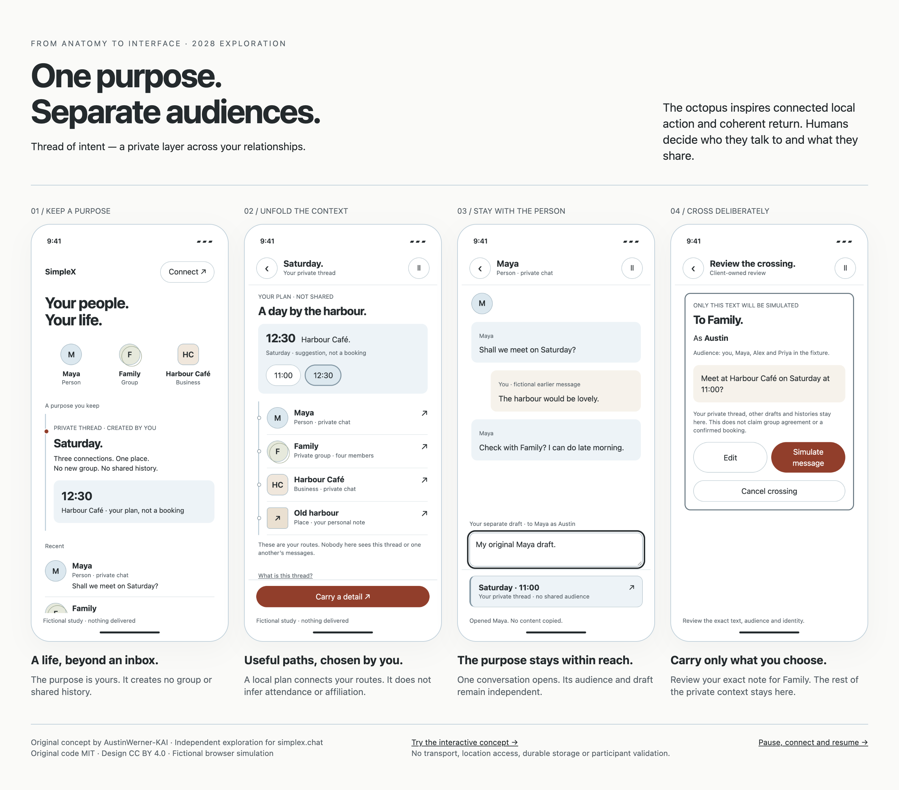

# Thread of intent — one purpose, separate audiences

**Follow-on exploration:** [Pause → Return → Resume with a QR connection detour](CONNECT_AND_RETURN.md) adds 28 separate browser checks and a [rendered storyboard](../studies/connect-return-board.html). The original 35 checks below retain their original scope.

10 October 2026. Original exploratory concept by AustinWerner-KAI for **From anatomy to interface**. [Interactive phone](../studies/intent.html?mobile=1) · [Visual storyboard](../studies/intent-board.html) · [Rendered PNG board](../studies/intent-captures/concept-board.png). The current full-app candidate remains V2.1.2.3. This concept is independent, speculative and not a SimpleX roadmap or participant finding.

## The design bet

Someone arranging a day with a friend may need to speak to a group, check a business and remember a place. A conventional series of chats leaves them to reconstruct the purpose each time. We have not measured that cost. Our hypothesis is that a **private purpose layer** can hold the person's own context while relationships and audiences stay separate.

The menu still begins with people and entities. A purpose is an optional route among them, not a new group, a merged social graph or a compulsory organising system. The founder's supplied feedback prioritises who people engage with over product or communication format; this concept tests how private organisation might support that direction. It is our interpretation, not his endorsement.

The innovation proposed here is a combination of behaviours: a private purpose dock within separate chats, an adaptable local planning surface, a saved place without surveillance, and deliberate transfer of a user-authored detail. We make no claim that any individual pattern is unprecedented or that this is what 2028 will inevitably look like.

## Alternatives considered before building

| Approach | What changes | Reason to keep or challenge it |
| --- | --- | --- |
| Private purpose layer — selected for exploration | Your own plan and routes remain available as the conversation changes | May reduce reconstruction; risks adding another place to manage |
| Shared planning group | Everyone plans in one new group | Familiar, but changes membership and exposes a common history |
| Ordinary favourites and search | No additional layer | Simplest baseline; may already solve the problem well enough |
| Single merged timeline | Histories appear together | Risks audience confusion and requires different core work; not built |
| AI-inferred context | Software guesses related people and extracts plans | Low setup cost, but inference and disclosure risks conflict with deliberate control |
| A portable source-message capsule | Carry an attributed excerpt between chats | Potentially useful; source-disclosure gate T21 remains unresolved, so this study uses only your own note |
| Remove planning controls | Keep only manually chosen routes | Smaller feature surface; compare if the local object proves unnecessary |

## What you can try

1. **Start with people.** Home offers Maya, Family and Harbour Café. A fictional manually organised Saturday thread sits below them.
2. **Unfold the purpose.** Your local time and café remain beside routes to a person, private group, business and personal place note. These routes do not imply attendance, employment or group membership.
3. **Stay with a person.** Opening Maya shows only Maya's conversation. Her audience is explicit. Your separate draft and a private Saturday dock remain available.
4. **Resume the purpose.** The dock unfolds the private layer. Back names Maya and restores her draft and the dock focus. No history is copied into this layer.
5. **Carry one detail.** Choose a recipient with none preselected. Edit your own note. No other draft, message history, source identity or saved place note is attached.
6. **Review the crossing.** The client-authored review shows exact text, recipient, identity and Family's fictional members when applicable. Cancel adds no message.
7. **Return.** Simulate a message to the chosen relationship. Its separate draft survives. The private purpose is still available. Earlier simulated snapshots do not change when you edit your local plan.
8. **Keep a place without tracking.** Old harbour is a fictional manually saved note and original diagram. It has no chat composer, geolocation, directions or real-world attendance claim.

A changed time updates the initial template only until you edit the note. An edited note is never silently rewritten. It may differ from the local time: the review shows exactly what you are about to simulate, so the study does not imply automatic synchronisation. Identical text to the same recipient is suppressed within this page instance; this is a deliberately narrow simulation rule, not production idempotency or a rule against legitimate resends.

## Visual language and spatial idea

White is the reading canvas. Subtle blue material identifies the local plan and private dock; oat distinguishes an earlier own-message fixture and the outgoing review text. Words stay neutral; clay indicates the deliberate crossing action. Labels and marks distinguish a person, group, business and place, independently of colour. Existing shape scale: circular people/controls, pill actions, 12 px containers, 6 px place mark.

The octopus tells are functional: a slim connective margin with local contact points, an extension that stays attached to a purpose, and a dock that folds away without losing its origin. No tentacle artwork or biological claim is required. Humans choose the people, purpose and disclosures. No inferred community or automatic home rearrangement.

The first board inspection exposed a clipped Carry action. The final lens places it in a fixed lower dock, with a scrollable local surface above. Added checks assert the action is inside the phone at 320, 390, 768 and 1440 CSS px browser widths. The plan was compacted to give its relationships more surface. Motion is a 200 ms opacity/translation unfold and is removed for reduced motion. The browser study uses 44 CSS px targets; it makes no native pt/dp claim.

## All rendered scenes

| Scene | Original browser-rendered PNG |
| --- | --- |
| Human home with private purpose | [01-home](../studies/intent-captures/01-home.png) |
| Local purpose and entity routes | [02-purpose](../studies/intent-captures/02-purpose.png) |
| Maya with private purpose dock | [03-maya](../studies/intent-captures/03-maya.png) |
| Saved place, no location tracking | [04-place](../studies/intent-captures/04-place.png) |
| Recipient choice and editable detail | [05-carry](../studies/intent-captures/05-carry.png) |
| Exact group review | [06-review](../studies/intent-captures/06-review.png) |
| Immutable simulated snapshot | [07-snapshot](../studies/intent-captures/07-snapshot.png) |
| Return with Maya's original draft | [08-return](../studies/intent-captures/08-return.png) |
| Four-scene board | [concept-board](../studies/intent-captures/concept-board.png) |

The board selects scenes from one test journey; the purpose time changes from 12:30 to 11:00 between scenes. Those are intentional local edits, not automatic changes. All imagery is original HTML/CSS/SVG rendered in Chrome with fictional input and reduced motion. No external photography or generated raster artwork. Code MIT; original design CC BY 4.0 under repository terms.

## Evidence, limits and reversal criteria

[35 browser checks](intent-check.json) · [editable check/render script](../scripts/check-intent.cjs). These cover audience distinctions, independent drafts, no-copy navigation, local time, cancellation, exact review, immutable snapshot, explicit return/focus, protected edited notes, place limits, width fit, reachable Carry action, target heights, reduced motion, board assets and JavaScript errors.

This is a fixed catalog of client-authored scenes. It does not execute sender code or model output, enforce a security boundary, integrate the SimpleX core, load real messages, request permissions, transport messages or persist data. Reload clears changes. The private-thread labels describe this no-transport simulation, not encrypted device storage. Browser history stays within fictional scenes; entity deep links are not supported. Ordinary drafts are editable but their own send control is outside this concept; only the Carry flow simulates an outgoing message. Purpose creation, choosing its connections, profile isolation, multiple purposes, background eviction, failure/retry and production storage remain open.

**Riskiest assumption:** people understand that the purpose is private while the carried note has a named audience. Test this before visual preference. On consenting participants' phones, compare an ordinary favourites/list condition with the same task: resume Maya, check Family, review a note to Family, cancel, and return to Maya's original draft. Ask who can see the purpose, who sees the note, and whether the group agreed. Count wrong audiences, lost drafts, reconstruction and hints; do not infer comprehension from a preference score.

Drop the layer if people mistake it for a group, believe histories are shared, spend more effort maintaining it, or complete the same task more clearly through ordinary favourites/search. Simplify to routes alone if the plan object adds no value. T05/T21/T22 stay open. This continues the owner's explicit visual-exploration exception, not a completed participant or privacy gate.

## Octopus check

- **Rules:** Coordinate; Cross deliberately. Retained drafts and return support those rules, rather than claiming biological evidence.
- **SimpleX starting point:** named relationships, deliberate messages and one open chat. No new core capability is asserted.
- **Analogy:** locally useful extensions remain attached to their coordinating purpose, and a boundary is crossed only by explicit choice.
- **Pre-change failure:** the preceding menu lacks the private purpose dock and Carry review; the new journey cannot run. The initial concept clipped its primary Carry control; the added visibility assertion catches that regression.
- **Research:** [Interfaces that arrive §9.1 F5/F6/F8/F11, §10.1, §10.2–10.4](RESEARCH_NOTES/INTERFACES_THAT_ARRIVE.md#91-principles); [Chat scrolling §6](RESEARCH_NOTES/CHAT_SCROLLING.md#6-what-this-means-for-the-prototype). Separate sequential chats avoid claiming several live timelines; retention of drafts remains a proposed browser behaviour, not an upstream implementation claim.
- **Reverse if:** the private-purpose/shared-note distinction fails, maintenance cost exceeds reconstruction savings, or ordinary relationships and search perform better.

Applied mobile-app-ui-design to mobile composition and controls, and product-brainstorming to alternatives and assumption testing. This rationale is original project synthesis of the cited internal research and user-provided feedback; it adds no external biological, medical or protocol facts.
