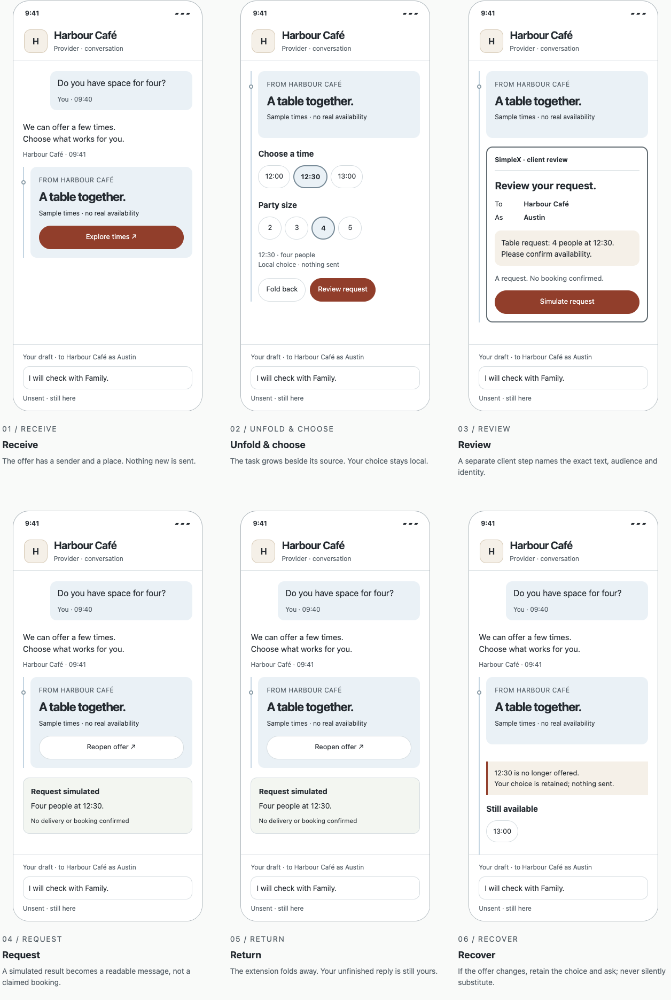

# Visual study — the conversation is the place

Prepared 9 October 2026; published 10 October 2026. **[Open the six-screen storyboard and interactive phone](../studies/workspace.html)**. [Download the rendered board](../studies/workspace-captures/storyboard.png). Independent future SimpleX design experiment, not an official feature, booking service or validated release. Current full-app candidate remains V2.1.2.3.

## Every screen, rendered

| Moment | PNG | What it conveys |
| --- | --- | --- |
| 01 Receive | [Screen](../studies/workspace-captures/01-receive.png) | A fictional offer arrives from a named provider |
| 02 Unfold and choose | [Screen](../studies/workspace-captures/02-choose.png) | Local controls extend beside the source message |
| 03 Review | [Screen](../studies/workspace-captures/03-review.png) | Client review names exact text, recipient and identity |
| 04 Request | [Screen](../studies/workspace-captures/04-request.png) | Explicit simulated result, no booking/delivery claim |
| 05 Return | [Screen](../studies/workspace-captures/05-return.png) | Task folds back; draft stays available |
| 06 Recover | [Screen](../studies/workspace-captures/06-recover.png) | Removed availability is explained without substitution |

Interactive-state renders: [selection](../studies/workspace-captures/choices.png), [review](../studies/workspace-captures/review.png), [changed offer](../studies/workspace-captures/recovery.png). These use the fictional draft entered by the check script. All images are browser renders of original HTML/CSS, not AI-generated device pictures or captures of the SimpleX app. Original project design licensing applies. Render source: [script](../scripts/check-workspace-visual.cjs).

## Mobile brief and visual thesis

Mobile web communication study, aimed at people arranging a small gathering with a provider while retaining an unfinished reply. Explore ordinary phone widths and desktop comparison. No native OS support is claimed. Consequence of error: confusing a local choice with a sent request or a confirmed booking. No real dates, availability, credentials, permissions, networking or persistence.

Keep one relationship visible as an actionable object grows within it. The octopus supplies attached local extension and coherent return; familiar names, time choices and explicit controls serve humans. A source rail and small origin point provide a subtle visual tell, rather than literal arms or a radial menu.

White canvas, pale-blue source material, neutral text, oat review payload and clay actions continue the owner's palette. Colour reinforces meaning but labels supply it. Containers use 12 px corners; actions are pills; desktop device frames are presentation only. Controls start at 44 CSS px, not equivalent to native pt/dp. Text starts at 12 px; the editable draft is 16 px. There are no remotely loaded fonts or decorative images.

## Interactions and recovery

Explore times → choose → review → simulate request → fold back. Local choices use the tested [contract](WORKSPACE_CONTRACT.md). Cancel or Escape leaves no request. The composer remains outside the replaceable workspace, retaining its latest text. Fold restores the locally captured thread position and focus to the source offer. A simulation receipt becomes a readable conversation object.

External study controls change the offer, expire/withdraw it, fail the next request or reset the fixture. They are outside the proposed app. Reset preserves the current draft but clears simulated requests and choices. Duplicate requests are blocked per page instance. Failure requires fresh review. Availability is simulated, not fetched. Browser Back leaves the page or follows its document anchors; internal task dismissal uses Fold back, Cancel and Escape. Reload loses all study state.

The client review's visual distinction is a design hypothesis. Host/content methods share one JavaScript environment; this is not enforced isolation or spoofing protection. The interface does not execute sender code. Real transport, signed origin, source freshness, native keyboards, safe areas and durable resumption require further work.

## Validation and sequence exception

[27 browser checks](workspace-visual-check.json): six scenes, no-send selection/cancellation, exact review, latest draft, origin focus, duplicate suppression, offer change, failure/retry, expiry and horizontal fit at 320/390/768/1440 CSS px. A synthetic text-enlargement stress check is not native font scaling. Source: [check script](../scripts/check-workspace-visual.cjs). The [18 contract groups](booking-contract-check.json) remain the underlying state evidence.

Visual inspection found partially clipped review actions; removed a redundant cancel action and scrolled the focused review action into view. A regression checks that the commit control is fully inside the thread. Static renders were inspected for layout. No recruited participant, physical phone, VoiceOver/TalkBack or security test was used.

The owner explicitly requested visual mockups on 9 October after the logic work. This brings exploratory visuals forward from the research-first sequence. It does not complete T05, resolve T21 or declare T22 validated. Record this as exploratory Study A preparation, not a new full-app version. The ordinary-message comparator and participant comprehension work remain outstanding.

## Octopus check

- **Rules:** Act locally; Return coherently.
- **SimpleX starting requirements:** one named relationship, visible action identity and deliberate sending; no protocol integration is implemented.
- **Analogy:** a task extends at its source and returns without losing useful context.
- **Tests:** local choice/cancel queue nothing, review exposes exact payload, fold retains the edited draft and restores source focus. The pre-change build lacks this visual page and cannot pass these checks.
- **Research:** [Interfaces that arrive §9.1 F3/F5/F7/F8/F9](RESEARCH_NOTES/INTERFACES_THAT_ARRIVE.md#91-principles), [§10.2 sequence](RESEARCH_NOTES/INTERFACES_THAT_ARRIVE.md#102-sequence-of-studies), [§10.4 unresolved decisions](RESEARCH_NOTES/INTERFACES_THAT_ARRIVE.md#104-decisions-this-paper-does-not-make). Design framework: Kings of Mobile Design, local skill; these visuals are original project interpretation.
- **Revise/drop if:** people misunderstand preparation/sending/booking, cannot distinguish the client review, lose context on return, or complete the equivalent task more clearly through ordinary messages.
